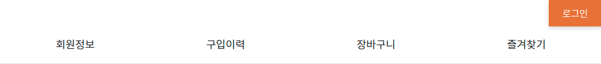
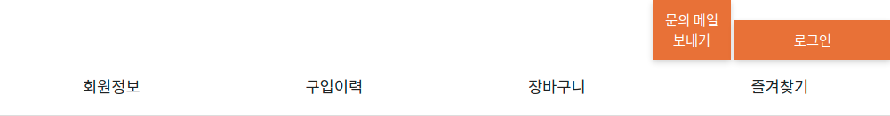
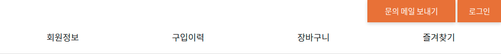

# CSS 방법론

FE 동동

<!-- 안녕하세요 CSS 방법론이라는 주제로 오늘 발표를 맡게 된 우아한테크코스 프론트엔드 3기 동동입니다. -->

# 순서

<!-- 먼저 발표의 순서는 다음과 같습니다.  -->

# 1. CSS란?

- Cascading Style Sheets의 약자
- HTML 또는 XML로 쓰여진 문서의 스타일을 나타내기 위해 사용되는 언어
- HTML이나 XML의 각 요소를 꾸미는 것이며, 문서의 구조와 스타일(디자인)을 분리하는 것이 역할

<!-- CSS는 Cascading Style Sheets의 약자입니다. Cascading 은 CSS의 특징 중 하나인데, 이는 추후 슬라이드에서 자세히 설명하도록 하겠습니다.  -->
<!-- CSS는 HTML 또는 XML로 쓰여진 문서의 스타일을 나타내기 위해 사용되는 언어로서, HTML로 표현되는 문서의 구조와 디자인적인 요소, 스타일을 분리하는 것이  CSS의 주역할입니다. -->

# 2. Cascading

- 동일 요소를 여러 셀렉터가 가리키고 여러 셀렉터가 같은 CSS 속성에 다른 값을 설정한 경우, 어떤 CSS속성값을 최종적으로 적용할지에 관한 알고리즘
- 다음 우선순위에 따라 적용할 CSS 속성값이 결정됩니다.

  1. 중요도: `!important` : `!important` 를 쓰면 가장 우선순위가 높다.

  2. 상세도: a < b < c
     a. 요소 셀렉터(`div`), 의사 요소(`::before`)
     b. 클래스 셀렉터(`.class`), 속성 셀렉터(`[attr]`), 의사 클래스(`:first-child`)
     c. ID 셀렉터(`#id`)

  3. 코드 순서: 동일한 우선순위인 경우에는 나중에 정의한 항목이 적용된다

  <!--
  - 이름에서 본 것과 같이 CSS의 핵심
  inline으로 style을 정의한 경우 항상 중요도가 높다. 다만 inline에 important 를 기재 하지 않은 경우에는 important로 inline 속성을 덮어씌울 수 있다. -->

# 3. CSS 등장 이전/이후의 스타일링

## 3-1. CSS 등장 이전

스타일을 각 요소의 전용 속성이나 style 속성으로 일일이 지정

```html
<font color="#00f"> 이 텍스트는 파란색으로 표시됩니다. </font>

<p style="color: #f00; font-size: 18px">
  이 텍스트는 18px 의 빨간 문자로 표시됩니다
</p>
```

<!--
 CSS가 등장하기 이전에는 스타일을 각 요소의 전용 속성이나 style속성으로 일일이 지정하여야 했습니다.
 font 요소는 deprecated되어 사용이 권장되지 않습니다만, 예시를 위하여 사용하였습니다.
 font 요소의 color 속성에 hex 코드를 넣어 font에 색상 스타일을 부여하거나 각 요소의 style 속성에 스타일을 부여하여야 했습니다.
이러한 방법은, 같은 스타일 요소를 여러 페이지마다 사용하려면 수정할 때 그만큼 반복 수정을 해야 한다는 문제점과,  HTML이나 XML은 본래 문서 구조를 의미하므로 스타일을 지정하는 것은 바람직하지 않다는 문제점이 있습니다.
 -->

## 3-2. CSS 등장 이후

```css
/* index.css */

p {
  color: #f00;
  font-size: 18px;
}
```

```html
<!-- index.html -->

<p>이 텍스트는 18px 의 빨간 문자로 표시됩니다</p>
```

<!--  css 등장 이후에는 css 파일에는 스타일을 기재하고 html에는 문서의 구조를 작성하여, 관심사의 분리가 이루어지게 되었습니다. 또한, css는 기본적으로 전역 범위이므로 한 번 p 요소에 스타일링을 부여하면 여러 페이지에서도 동일하게 적용되므로, 반복 수정을 피할 수 있게 되었습니다. -->

# 4.CSS의 문제점

- CSS에서는 모든 것이 전역 범위이므로, 모든 스타일링이 서로 간섭할 가능성이 있다.

- CSS파일이 분리되어 있다 하더라도 이 파일들을 읽어 들인 HTML/XML 에서는 모든 스타일링이 동일한 범위 안에 존재하게 된다.

- 웹사이트가 점점 복잡해지면서 유지보수가 용이한 CSS 를 작성하는 것이 어려워졌고, 이를 해결하기 위한 CSS 방법론이 여러 가지 대두되었다.

<!-- CSS가 등장한 시절에는 지금과 같이 복잡한 웹사이트가 없었습니다. 일관된 스타일을 유지하기 위해 상위에서 정의한 색상, 글꼴, 사이즈, 너비, 레이아웃 등이 상속되는 것은 매우 효과적인 방법이었을 것입니다.

-->

# 5. OOCSS

## 5-1. OOCSS란

- Object Oriented CSS: 객체 지향 CSS

  1. 레고처럼 자유로운 조합이 가능한 모듈의 집합을 만든다
  2. 그 모듈을 조합해 페이지를 만든다.
  3. 그리하여 신규 페이지를 만드는 경우에도 기본적으로 추가적인 CSS를 만들 필요가 없다.

- 레고와 같은 모듈을 구현하기 위한 두 가지 원칙

  1. 스트럭처(구조)와 스킨(화면) 분리
  2. 컨테이너와 콘텐츠 분리

<!--
위와 같은 발상으로 제창된 OOCSS 는 다른 CSS 설계 기법에도 조금씩 영향을 주었습니다.

이 레고와 같은 모듈을 구현하기 위한 구체적인 수법으로 다음 두 가지 원칙을 들 수 있습니다. -->

## 6-2. 스트럭처(구조)와 스킨(화면) 분리

### 스트럭처와 스킨 분리 전


```html
<main id="main">
  <button class="btn-general">기본 버튼</button>
  <button class="btn-warning">취소 버튼</button>
</main>
```

---

```css
#main .btn-accept {
  width: 10rem;
  max-width: 100%;
  padding: 0.75rem;
  font-weight: 500;
  background-color: rgb(244, 63, 94);
  color: white;
  box-shadow: 0 3px 6px rgb(0 0 0 / 16%);
  font-size: 1rem;
  line-height: 1.5rem;
  text-align: center;
  border-radius: 0.5rem;
  border: none;
}

#main .btn-cancel {
  width: 10rem;
  max-width: 100%;
  padding: 0.75rem;
  font-weight: 500;
  background-color: rgb(243, 244, 246);
  color: black;
  box-shadow: 0 3px 6px rgb(0 0 0 / 16%);
  font-size: 1rem;
  line-height: 1.5rem;
  text-align: center;
  border-radius: 0.5rem;
  border: none;
}
```

---

### 스트럭처와 스킨 분리 후


```css
/* 스트럭쳐 */
#main .btn {
  width: 10rem;
  max-width: 100%;
  /* ... 중략 */
}

/* 스킨 */
#main .accept {
  background-color: rgb(244, 63, 94);
  color: white;
}

#main .cancel {
  background-color: rgb(243, 244, 246);
  color: black;
}

#main .danger {
  background-color: rgb(176, 0, 32);
  color: white;
}
```

<!--
스트럭처에 해당하는 속성은 크게 다음과 같습니다.

- width
- height
- padding
- margin

스킨에 해당하는 속성은 크게 다음과 같습니다.

- color
- font
- background
- box-shadow
- text-shadow

위와 같이 구분할 수 있지만 OOCSS 에서는 명확하게 결정되어 있는 것은 아닙니다. 이 부분은
너무 이론에 얽매이지 말고 경우에 따라 적절하게 분류하는 방법을 사용해도 무방합니다
 -->

## 6-4. 컨테이너와 콘텐츠 분리

- 특정한 콘텍스트에 지나치게 의존하지 않는다.
- 컨테이너는 '영역', 콘텐츠는 '모듈'

```html
<!-- 컨테이너 -->
<main id="main">
  <!-- 콘텐츠 -->
  <button class="btn-general">기본 버튼</button>
  <!-- 콘텐츠 -->
  <button class="btn-warning">취소 버튼</button>
</main>
```

---

<!--
현재 컨테이너는 대략 ‘영역’, 콘텐츠는 바로 앞절에서 본 ‘버튼’ 모듈을 생각하면 됩니다. 예를 들어, 바로 앞의 예시에서는 버튼 모듈은 id 속성에 ‘ main ’이 지정된 main 요소 안에 포함되어 있습니다  이 상태에서는 버튼을 main 밖에서 사용하려 해도 그럴 수 없습니다. 이 문제에 대한 해결 방법은 매우 간단합니다.
 -->

```css
/* 컨테이너 */
#main {
  display: grid;
  place-items: center;
  padding: 1rem;
}

/* 컨텐츠 */
/* #main .btn { */
.btn {
  width: 10rem;
  max-width: 100%;
  padding: 0.75rem;
  font-weight: 500;
  box-shadow: 0 3px 6px rgb(0 0 0 / 16%);
  font-size: 1rem;
  line-height: 1.5rem;
  text-align: center;
  border-radius: 0.5rem;
  border: none;
}
```

<!-- 버튼 모듈을 main 밖에서도 동작하도록 CSS 셀렉터를 수정합니다. 컨테이너와 콘덴츠의 분리라는 것은 다시 말해 ‘모듈을 가능한 특정한 영역에 의존하지
않도록 한다’는 지침을 의미합니다 -->

## 6-5. OOCSS 정리

- OOCSS의 역사는 매우 길며 명확하게 규칙이라고 불리는 것도 많지 않다
- 다른 CSS 방법론들은 기본적으로 크건 작건 OOCSS를 참조하면서 개선을 한 것입니다.
  오늘날 OOCSS 한 가지만으로 실질적인 CSS 설계를 수행하는 것은 그다지 현실적이지 않습니다.
  <!-- (공식 사이트를 보면 알 수 있지만 설명도 매우 간략합니다). -->
  <!--
  오늘날 OOCSS 한 가지만으로 실질적인 CSS 설계를 수행하는 것은 그다지 현실적이지 않습니다.
  그러나 10년 전 제창한 사고방식이 다른 CSS 설계 기법에 녹아들어，지금까지도 사용되는 것을 생각하면 OOCSS 가 표방했던 사고는 CSS 설계에 있어 ‘하나의 진리’라고 해도 과언이 아니
  라고 생각합니다. OOCSS 는 CSS 설계의 기초 중의 기초이므로 이 내용들을 꼭 기억해 두시기 바랍니다.
   -->

# 7. SMACSS

## 7-1. SMACSS란?

- Scalable and Modular Architecture for CSS
- 조나단 스눅 (Jonathan Snook)이 제창
- CSS를 위한 확장 가능한 모듈 아키텍쳐

- CSS 코드를 그 역할에 따라 분류한 것이 특징
  1. 베이스(Base)
  2. 레이아웃(Layout)
  3. 모듈(Module)
  4. 스테이트(State)
  5. 테마(Theme)

OOCSS에서 다룬 내용은 SMACSS의 모듈과 거의 비슷.
OOCSS는 거의 모듈만 언급했던 것에 비해 SMACSS는 보다 폭넓고 실제로 웹사이트를 구축하는 데 있어 빼놓을 수 없는
베이스나 레이아웃 코드를 다루는 방법까지 설명하고 있습니다.

## 7-2. 베이스(Base)

프로젝트의 표준 스타일을 정의. 리셋 CSS도 베이스 규칙에 포함됨.

```css
body {
  background-color: #fff;
}

a:hover {
  text-decoration: none;
}
```

## 7-3. 레이아웃 규칙

- 헤더나 메인 영역，사이드 바，푸터 등 웹사이트의 큰 틀을 구성하는 큰 모듈 에 관한 규칙
- 레이아웃을 구성하는 것의 대부분은 특정 페이지에서 한 차례만 사용되는 것이 많으므로, ID 셀렉터를 활용한 스타일링을 허용
- 레이아웃과 관련해서 반복적으로 사용하는 모듈의 경우에는 클래스 셀렉터를 이용합니다.

```html
<header id="header">This is Header</header>
<main id="main">
  This is Main
  <section class="section">Section 1</section>
  <section class="section">Section 2</section>
  <section class="section">Section 3</section>
</main>

<footer id="footer">This is Footer</footer>
```

---

```css
/* ID 셀렉터 예시*/
#header {
  width: 1080px;
  margin-right: auto;
  margin-left: auto;
  background-color: #fff;
}

#main {
  width: 1080px;
  margin-right: auto;
  margin-left: auto;
  background-color: #fff;
}

#footer {
  width: 1080px;
  margin-right: auto;
  margin-left: auto;
  background-color: #eee;
}

/* 클래스 셀렉터 예시 */
.section {
  padding-top: 80px;
  padding-bottom: 80px;
}
```

---

<!-- ### 특정한 상황에서만 Layout을 변경하고 싶은 경우

예를 들어, ‘특정한 페이지에서는 가로 폭을 좁히고 싶은 경우에는 손자 셀렉터를 이용해 레이
아웃 모듈의 스타일을 덮어쓸 수 있습니다. 다음 코드에서는 body 요소에 .l-narrow 클래스를 붙여서 손자 셀렉터를 사용해 헤더，메인 영역, 푸터의 가로 폭을 좁혔습니다

---

```html
<body class="l-narrow">
  <header id="header">
  </header>
  <main id="main">
  </main>
  <footer id="footer">
  </footer>
</body>
```

```css
.l-narrow #header {
  width: 960px;
}

.l-narrow #main {
  width: 960px;
}

.l-narrow #footer {
  width: 960px;
}
```

-->

## 7-4. 모듈 규칙

- 모든 모듈은 레이아웃 규칙 안에 배치되는 것을 가정
- 다른 페이지로 이동하거나 다른 레이아웃 안에 삽입하더라도 형태가 부서지거나 달라지지 않고 사용할 수 있어야 합니다

  - 이 코드는 다른 레이아웃으로 이동했을 때 영향이 없는가 고려
    => 특정한 콘텍스트에 지나치게 의존하지 않는다.

- 한 페이지 내에서 반복해서 사용되는 상황을 가정하고 있으므로 당연히 ID 셀렉터에서의 구현은 하지 않으며. 모듈의 루트 요소에는 반드시 클래스 셀렉터 (HTML 에서는 클래스 속성)를 사용합니다.
- 가급적 요소형 셀렉터를 사용하지 않는다.
  -> HTML과 스타일링을 느슨하게 결합한다
  - 요소형 셀렉터를 쓰는 경우 손자 셀렉터가 아닌 자녀 셀렉터(>)를 사용하여 영향 범위를 지나치게 넓히지 않는다.

---




여기꺄지는 지금 상태로 큰 문제는 없습니다.

질문을 받기 위한 용도로 버튼을 하나 더 배치하고, 해당 버튼은 조금 크게 표시
하고 싶은 경우가 생긴다면 어떻게 해야 할까요

---



요소 셀렉터를 사용하지 않고 서브 클래스를 만든다.
서브 클래스란?



```html
<header class="l-header">
  <a class="btn" href="#">로그인</a>
  <!-- 추가! -->
  <a class="btn" href="#">문의 메일 보내기</a>
  <nav>
    <ul class="headermenu">
      <li>
        <a href="#">회원정보</a>
      </li>
      <li>
        <a href="#">구입이력</a>
      </li>
      <li>
        <a href="#">장바구니</a>
      </li>
      <li>
        <a href="#">즐겨찾기</a>
      </li>
    </ul>
  </nav>
</header>
```

```css
.l-header .btn:nth-of-type(2) {
  width: 160px;
}
```

```css
/* 버튼 모듈의 원래 스타일링 */
.btn {
  display: inline-block;
  width: 300px;
  padding: 20px 10px;
  font-size: 18px;
  text-decoration: none;
  text-align: center;
  transition: 0.25s;
  border-width: 0;
  box-shadow: 0 3px 6px rgba(0, 0, 0, 0.16);
  color: #fff;
  background-color: #dd742c;
}

/* 헤더 스타일링 */

.l-header {
  max-width: 1230px;
  margin-right: auto;
  margin-left: auto;
  border-bottom: 1px solid #ddd;
  text-align: right;
}

/* 헤더 안에 배치되었을 때의 버튼 모듈 덮어쓰기 내용  */
.l-header .btn {
  width: 80px;
  padding-top: 10px;
  padding-bottom: 10px;
  font-size: 14px;
}
```

---

## 스테이트 규칙

- 스테이트는 기존 스타일을 덮어쓰거나 확장하기 위해 사용
- 모듈의 서브 클래스와 다른 점은,
  - 스테이트는 레이아웃이나 모듈에 할당할 수 있다.
  - 자바스크립트에 의존한다
- 스테이트 규칙에 따른 클래스 이름은 모두 `is-` 접두사를 붙인다.
  - 어떤 모듈에 적용하는지를 명확하게 하기 위해서 상태 스타일에 모듈 이름을 포함시킬 것을 권장하고 있습니다.
- 기존 스타일을 모두 덮어써서 상태 스타일을 반영하는 것을 기대하기 때문에 필요한 경우에는 !important 사용도 권장


## 테마 규칙

사이트 내 레이아웃이나 색상, 텍스트 처리 등을 일정한 규칙에 따라 덮어쓰는 것
기존의 다양한 스타일링이 덮어쓰기의 대상이 된다.

다크모드 전환, 테마 컬러 변경 등

## SMACSS 정리

SMACSS는 프로젝트에서 고려해야 하는 대부분의 CSS 규칙을 가지고 있습니다. 반면 각 규칙
이 그렇게 엄격하지는 않으며 어느 정도 유연함을 발휘하므로 비교적 느슨한 개발을 하는 경
우에 적합합니다. 다만 경우에 따라서는 규칙이 너무 유연해서 실제 코드의 지침으로 삼기 어
려운 경우도 있습니다. 그때는 모듈 규칙에 OOCSS를 적용하거나 뒤에서 설명할 BEM의 규칙
을 일부 적용하는 등 다른 설계 기법과 조합하는 경우도 많습니다.

# 8. BEM

## 8-1. BEM이란?

- Block, Element, Modifier
- 러시아의 Yandex 사가 제창한 a component-based approach to web development.
- UI를 독립적인 block으로 나눈다.
- 목적: 사용자 인터페이스를 독립된 블록으로 분리함으로써 복잡한 페이지에서도 간단하고 신속하게 개발을 수행
- 기본적으로는 모듈 기반의 방법이지만，그 내용이 다른 설계 기법에 비해 엄격하고 강력하여 세계적으로 이름이 알려졌으며 실제로 널리 사용되고 있다.
- 모듈을 Block, Element, Modifier 단위로 분해 및 정의합니다.

## 8-2. Block

A functionally independent page component that can be reused. In HTML, blocks are represented by the class attribute.

Features:

The block name describes its **purpose** ("What is it?" — menu or button), not its state ("What does it look like?" — red or big).

Example

<!-- Correct. The `error` block is semantically meaningful -->
<div class="error"></div>

<!-- Incorrect. It describes the appearance -->
<div class="red-text"></div>

The block shouldn't influence its environment, meaning you shouldn't set the external geometry (margin) or positioning for the block.

You also shouldn't use CSS tag or ID selectors when using BEM.

상세도를 가능한 균일하게 유지하려는 것이며, 뒤에서 설명할 Modifier나 Mix를 사용한
덮어쓰기를 쉽게 하기 위해서입니다. 그러므로 HTML에 여러 클래스가 붙어 있는 경우에도
상세도는 균일하게 유지하도록 합니다.

This ensures the necessary independence for reusing blocks or moving them from place to place.

### Guidelines for using blocks

**Nesting**
Blocks can be nested in each other.

You can have any number of nesting levels.

**Example**

<!-- `header` block -->
<header class="header">
    <!-- Nested `logo` block -->
    <div class="logo"></div>

    <!-- Nested `search-form` block -->
    <form class="search-form"></form>

</header>

## Elements

Element
A composite part of a block that can't be used separately from it.

Features:

The element name describes its purpose ("What is this?" — item, text, etc.), not its state ("What type, or what does it look like?" — red, big, etc.).

The structure of an element's full name is block-name**element-name. The element name is separated from the block name with a double underscore (**).

Example

```html
<!-- `search-form` block -->
<form class="search-form">
  <!-- `input` element in the `search-form` block -->
  <input class="search-form__input" />

  <!-- `button` element in the `search-form` block -->
  <button class="search-form__button">Search</button>
</form>
```

Guidelines for using elements
Nesting

Membership

Optionality

Nesting
Elements can be nested inside each other.

You can have any number of nesting levels.

An element is always part of a block, not another element. This means that element names can't define a hierarchy such as block**elem1**elem2.

Example

<!--
    Correct. The structure of the full element name follows the pattern:
    `block-name__element-name`
-->
<form class="search-form">
    <div class="search-form__content">
        <input class="search-form__input">

        <button class="search-form__button">Search</button>
    </div>

</form>

<!--
    Incorrect. The structure of the full element name doesn't follow the pattern:
    `block-name__element-name`
-->
<form class="search-form">
    <div class="search-form__content">
        <!-- Recommended: `search-form__input` or `search-form__content-input` -->
        <input class="search-form__content__input">

        <!-- Recommended: `search-form__button` or `search-form__content-button` -->
        <button class="search-form__content__button">Search</button>
    </div>

</form>
The block name defines the namespace, which guarantees that the elements are dependent on the block (block__elem).

A block can have a nested structure of elements in the DOM tree:

Example

<div class="block">
    <div class="block__elem1">
        <div class="block__elem2">
            <div class="block__elem3"></div>
        </div>
    </div>
</div>
However, this block structure is always represented as a flat list of elements in the BEM methodology:

Example

.block {}
.block**elem1 {}
.block**elem2 {}
.block\_\_elem3 {}
This allows you to change a block's DOM structure without making changes in the code for each separate element:

Example

<div class="block">
    <div class="block__elem1">
        <div class="block__elem2"></div>
    </div>

    <div class="block__elem3"></div>

</div>
The block's structure changes, but the rules for the elements and their names remain the same.

### Membership

An element is always part of a block, and you shouldn't use it separately from the block.

### Optionality

An element is an optional block component. Not all blocks have elements.

## block을 만들어야 할까요? element를 만들어야 할까요?

1. block을 만드세요

- 구현된 다른 페이지 컴포넌트에 의존하지 않는다면 코드가 재사용된다면 block을 만드세요

2. element를 만드세요

- 부모 엔티티(block) 없이 구분해서 사용할 수 없다면 element를 만드세요.
  더 작은 부분으로 나뉘어져야 하는 elements의 경우, service block을 만드세요.
  BEM에서는 elements의 elements는 만들 수 없습니다.

  ## Modifier

- An entity that defines the appearance, state, or behavior of a block or element.

Features:

The modifier name describes its appearance ("What size?" or "Which theme?" and so on — size_s or theme_islands), its state ("How is it different from the others?" — disabled, focused, etc.) and its behavior ("How does it behave?" or "How does it respond to the user?" — such as directions_left-top).

The modifier name is separated from the block or element name by a single underscore (\_).

- MindBEMding
  Modifier 전후의 구분 문자를 언더스코어 한 개에서 하이픈 두 개로 변경한 스타일

### pattern

`block-name--modifier-name`
`block-name__element-name--modifier-name`

`block-name--modifier-name--modifier-value`
`block-name__element-name--modifier-name--modifier-value`

### Types of modifiers

- Boolean
- Key-value

### Guidlines for using modifiers

- modifier 는 홀로 사용되지 않습니다.
  From the BEM perspective, a modifier can't be used in isolation from the modified block or element. A modifier should change the appearance, behavior, or state of the entity, not replace it.

### Why include the block name in modifier and element names?

- Provides a namespace.
- Allows the use of mixes.
- This makes searching in the code easier.

## Mix

- An instance of different BEM entities being hosted on a single DOM node.

- Block과 Element가 하나의 DOM node에 존재하는 것

Mixes allow us to

Combine the behaviors and styles of several BEM entities while avoiding code duplication.

Create semantically new interface components on the basis of existing BEM entities.

```
<!-- `header` block -->
<div class="header">
    <!--
        The `search-form` block is mixed with the `search-form` element
        from the `header` block
    -->
    <div class="search-form header__search-form"></div>
</div>
```

# 9. TailwindCSS

기존 CSS 방법론의 문제점

- Separation of Concern
  CSS가 HTML markup 구조와 강하게 결합되어 있다.
  CSS가 HTML에 의존한다

- Mixing Concerns
  HTML가 CSS에 의존한다

don't write CSS.

use utility class

# 10. Reference

- CSS 설계 실전 가이드
- [http://oocss.org/](http://oocss.org/)
- [http://smacss.com/](http://smacss.com/)
- [https://www.slideshare.net/stubbornella/object-oriented-css/22-Components_are_like_legos](https://www.slideshare.net/stubbornella/object-oriented-css/22-Components_are_like_legos)
- [BEM](https://en.bem.info/)

# 11. Any Questions?
