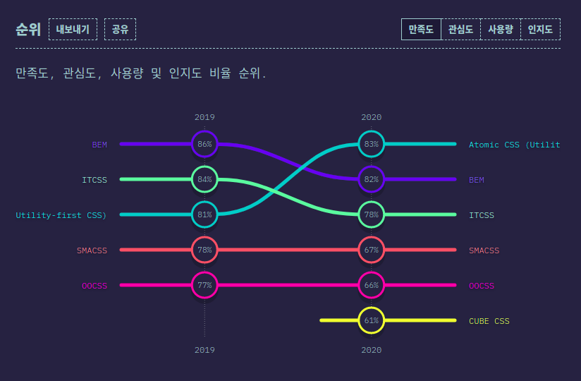
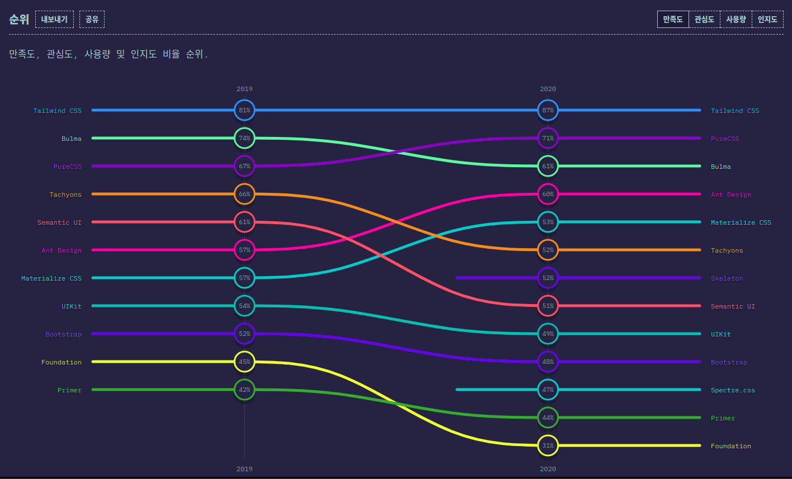
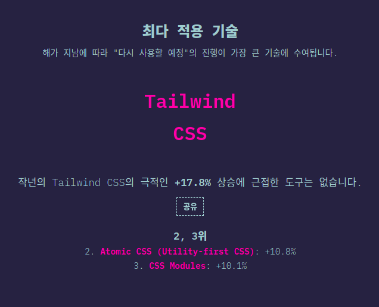

# CSS 방법론

FE 동동

<!-- 안녕하세요 CSS 방법론이라는 주제로 오늘 발표를 맡게 된 우아한테크코스 프론트엔드 3기 동동입니다. -->

# 순서

<!-- 먼저 발표의 순서는 다음과 같습니다.  -->

# 1. CSS란?

- HTML 또는 XML로 쓰여진 문서의 스타일을 나타내기 위해 사용되는 언어
- HTML이나 XML의 각 요소를 꾸미는 것과 문서의 구조와 스타일(디자인)을 분리하는 것이 역할

<!-- 다음 슬라이드에서 Cascading 인데, 이는 추후 슬라이드에서 자세히 설명하도록 하겠습니다.  -->
<!-- CSS는 HTML 또는 XML로 쓰여진 문서의 스타일을 나타내기 위해 사용되는 언어로서, HTML로 표현되는 문서의 구조와 디자인적인 요소, 스타일을 분리하는 것이  CSS의 주역할입니다. -->

# 2. Cascading

- CSS는 Cascading Style Sheets의 약자

- 여러 셀렉터가 동일한 요소를 가리키는 경우, 어떤 CSS속성값을 최종적으로 적용할지에 관한 알고리즘

- 다음 우선순위에 따라 적용할 CSS 속성값이 결정

  1. 중요도: `!important` : `!important` 를 쓰면 가장 우선순위가 높다.

  2. 상세도: a < b < c
     a. 요소 셀렉터(`div`), 의사 요소(`::before`)
     b. 클래스 셀렉터(`.class`), 속성 셀렉터(`[attr]`), 의사 클래스(`:first-child`)
     c. ID 셀렉터(`#id`)

  3. 코드 순서: 동일한 우선순위인 경우에는 나중에 정의한 항목이 적용된다

  <!--  CSS는 Cascading Style Sheets의 약자입니다. Cascading 은 CSS의 특징 중 하나로서 이름에 포함된 것을 보면 알 수 있듯 CSS의 핵심입니다.
  inline으로 style을 정의한 경우 항상 중요도가 높다. 다만 inline에 important 를 기재 하지 않은 경우에는 important로 inline 속성을 덮어씌울 수 있다. -->

# 3. CSS 등장 이전/이후의 스타일링

## 3-1. CSS 등장 이전

각 요소의 전용 속성이나 style 속성으로 스타일을 일일이 지정

```html
<font color="#00f"> 이 텍스트는 파란색으로 표시됩니다. </font>

<p style="color: #f00; font-size: 18px">
  이 텍스트는 18px 의 빨간 문자로 표시됩니다
</p>
```

<!--
 CSS가 등장하기 이전에는  각 요소의 전용 속성이나 style속성으로 스타일을 일일이 지정하여야 했습니다.
 font 요소는 deprecated되어 사용이 권장되지 않습니다만, 예시를 위하여 사용하였습니다.
 font 요소의 color 속성에 hex 코드를 넣어 font에 색상 스타일을 부여하거나 각 요소의 style 속성에   스타일을 부여하여야 했습니다.
이러한 방법은, 같은 스타일 요소를 여러 페이지마다 사용하려면 그만큼 반복해야 한다는 문제점과,  HTML이나 XML은 본래 문서 구조를 의미하므로 HTML에 직접 스타일을 지정하는 것은 바람직하지 않다는 문제점이 있습니다.
 -->

## 3-2. CSS 등장 이후

```css
/* index.css */

p {
  color: #f00;
  font-size: 18px;
}
```

```html
<!-- index.html -->

<p>이 텍스트는 18px 의 빨간 문자로 표시됩니다</p>
```

<!--  css 등장 이후에는 css 파일에는 스타일을 기재하고 html에는 문서의 구조를 작성하여, 관심사의 분리가 이루어지게 되었습니다. 또한, css는 기본적으로 전역 범위이므로 한 번 p 요소에 스타일링을 부여하면 여러 페이지에서도 동일하게 적용되므로, 반복을 피할 수 있게 되었습니다. -->

# 4.CSS의 문제점

- CSS에서는 모든 것이 전역 범위이므로, 모든 스타일링이 서로 간섭할 가능성이 있다.

- CSS파일이 분리되어 있다 하더라도 이 파일들을 읽어 들인 HTML/XML 에서는 모든 스타일링이 동일한 범위 안에 존재하게 된다.

- 웹사이트가 점점 복잡해지면서 유지보수가 용이한 CSS 를 작성하는 것이 어려워졌고, 이를 해결하기 위한 CSS 방법론이 여러 가지 대두되었다.

<!-- CSS가 등장한 시절에는 지금과 같이 복잡한 웹사이트가 없었습니다. 일관된 스타일을 유지하기 위해 상위에서 정의한 색상, 글꼴, 사이즈, 너비, 레이아웃 등이 상속되는 것은 매우 효과적인 방법이었을 것입니다.

-->

# 5. OOCSS

<!-- 첫번째로 말씀드릴 CSS방법론은 OOCSS 입니다. -->

## 5-1. OOCSS란

- Object Oriented CSS: 객체 지향 CSS

  1. 레고처럼 자유로운 조합이 가능한 모듈의 집합을 만든다
  2. 그 모듈을 조합해 페이지를 만든다.
  3. 그리하여 신규 페이지를 만드는 경우에도 기본적으로 추가적인 CSS를 만들 필요가 없다.

- 레고와 같은 모듈을 구현하기 위한 두 가지 원칙

  1. 스트럭처(구조)와 스킨(화면) 분리
  2. 컨테이너와 콘텐츠 분리

<!--
위와 같은 발상으로 제창된 OOCSS 는 다른 CSS 설계 기법에도 조금씩 영향을 주었습니다.

이 레고와 같은 모듈을 구현하기 위한 구체적인 수법으로 다음 두 가지 원칙을 들 수 있습니다. -->

## 6-2. 스트럭처(구조)와 스킨(화면) 분리

### 스트럭처와 스킨 분리 전


```html
<main id="main">
  <button class="btn-accept">기본 버튼</button>
  <button class="btn-cancel">취소 버튼</button>
</main>
```

---

```css
#main .btn-accept {
  width: 10rem;
  max-width: 100%;
  padding: 0.75rem;
  font-weight: 500;
  background-color: rgb(244, 63, 94);
  color: white;
  box-shadow: 0 3px 6px rgb(0 0 0 / 16%);
  font-size: 1rem;
  line-height: 1.5rem;
  text-align: center;
  border-radius: 0.5rem;
  border: none;
}

#main .btn-cancel {
  width: 10rem;
  max-width: 100%;
  padding: 0.75rem;
  font-weight: 500;
  background-color: rgb(243, 244, 246);
  color: black;
  box-shadow: 0 3px 6px rgb(0 0 0 / 16%);
  font-size: 1rem;
  line-height: 1.5rem;
  text-align: center;
  border-radius: 0.5rem;
  border: none;
}
```

<!--
스트럭처에 해당하는 속성은 크게 다음과 같습니다.

- width
- height
- padding
- margin

스킨에 해당하는 속성은 크게 다음과 같습니다.

- color
- font
- background
- box-shadow
- text-shadow

위와 같이 구분할 수 있지만 OOCSS 에서는 명확하게 결정되어 있는 것은 아닙니다. 이 부분은
너무 이론에 얽매이지 말고 경우에 따라 적절하게 분류하는 방법을 사용해도 무방합니다

따라서 공통적인 부분을 스트럭처에 해당한다고 보고, 기본 버튼과 취소 버튼이 서로 다른 backgroundColor 와 color를 스킨으로 보고 이를 분리해보도록 하겠습니다.
 -->

---

### 스트럭처와 스킨 분리 후

```css
/* 스트럭쳐 */
#main .btn {
  width: 10rem;
  max-width: 100%;
  /* ... 중략 */
}

/* 스킨 */
#main .accept {
  background-color: rgb(244, 63, 94);
  color: white;
}

#main .cancel {
  background-color: rgb(243, 244, 246);
  color: black;
}

#main .danger {
  background-color: rgb(176, 0, 32);
  color: white;
}
```

<!--
공통된 부분을 스트럭처로 제외를 하고, 각 버튼마다 다른 부분인 color와 background-color를 스킨으로 분리하였습니다.

 -->

---


```html
<main id="main">
  <button class="btn accept">기본 버튼</button>
  <button class="btn cancel">취소 버튼</button>
  <button class="btn danger">위험 버튼</button>
</main>
```

```css
#main .danger {
  background-color: rgb(176, 0, 32);
  color: white;
}
```

<!--
위험 버튼을 추가할 때에는 background-color와 color를 지정한 danger 클래스만 추가하면 간단하게 만들 수 있습니다. -->

## 6-4. 컨테이너와 콘텐츠 분리

- 특정한 콘텍스트에 지나치게 의존하지 않는다.
- 컨테이너는 '영역', 콘텐츠는 '모듈'

```html
<!-- 컨테이너 -->
<main id="main">
  <!-- 콘텐츠 -->
  <button class="btn accept">기본 버튼</button>
  <!-- 콘텐츠 -->
  <button class="btn cancel">취소 버튼</button>
  <!-- 콘텐츠 -->
  <button class="btn danger">위험 버튼</button>
</main>
```

---

<!--
컨테이너는 대략 ‘영역’, 콘텐츠는 바로 앞절에서 본 ‘버튼’ 모듈을 의미합니다. 예를 들어, 바로 앞의 예시에서는 버튼 모듈은 id 속성에 ‘ main ’이 지정된 main 요소, 컨테이너 안에 포함되어 있습니다  이 상태에서는 버튼을 main 밖에서 사용하려 해도 그럴 수 없습니다. 이 문제에 대한 해결 방법은 매우 간단합니다.
 -->

```css
/* 컨테이너 */
#main {
  display: grid;
  place-items: center;
  padding: 1rem;
}

/* 컨텐츠 */
/* #main .btn { */
.btn {
  width: 10rem;
  max-width: 100%;
  padding: 0.75rem;
  font-weight: 500;
  box-shadow: 0 3px 6px rgb(0 0 0 / 16%);
  font-size: 1rem;
  line-height: 1.5rem;
  text-align: center;
  border-radius: 0.5rem;
  border: none;
}
```

<!-- 버튼 모듈을 main 밖에서도 동작하도록 CSS 셀렉터를 수정합니다. 컨테이너와 콘덴츠의 분리라는 것은 다시 말해 ‘모듈을 가능한 특정한 영역에 의존하지
않도록 한다’는 지침을 의미합니다 -->

## 6-5. OOCSS 정리

- OOCSS의 역사는 매우 길며 명확하게 규칙이라고 불리는 것도 많지 않다

- 다른 CSS 방법론들은 기본적으로 크건 작건 OOCSS를 참조하면서 개선한 것

- 오늘날 OOCSS 한 가지만으로 실질적인 CSS 설계를 수행하는 것은 그다지 현실적이지 않음

  <!-- (공식 사이트를 보면 알 수 있지만 설명도 매우 간략합니다). -->
  <!--
  오늘날 OOCSS 한 가지만으로 실질적인 CSS 설계를 수행하는 것은 그다지 현실적이지 않습니다.
  그러나 10년 전 제창한 사고방식이 다른 CSS 설계 기법에 녹아들어，지금까지도 사용되는 것을 생각하면 OOCSS 가 표방했던 사고는 CSS 설계에 있어 ‘하나의 진리’라고 해도 과언이 아니
  라고 생각합니다. OOCSS 는 CSS 설계의 기초 중의 기초이므로 이 내용들을 꼭 기억해 두시기 바랍니다.
   -->

# 7. SMACSS

## 7-1. SMACSS란?

- Scalable and Modular Architecture for CSS
- 조나단 스눅 (Jonathan Snook)이 제창

- CSS 코드를 그 역할에 따라 분류한 것이 특징
  1. 베이스(Base)
  2. 레이아웃(Layout)
  3. 모듈(Module)
  4. 스테이트(State)
  5. 테마(Theme)

<!--
SMACSS는 Scalable and Modular ARchitecture for CSS의 머리글자로서, CSS를 위한 확장 가능한 모듈 아키텍쳐라는 뜻으로 '스맥스'라고 발음합니다.
앞장에서 다룬 OOCSS 내용은 SMACSS의 모듈과 거의 비슷합니다.
OOCSS는 SMACSS를 기준으로 보았을 때 거의 모듈만 언급했던 것에 비해 SMACSS는 보다 폭넓고 실제로 웹사이트를 구축하는 데 있어 빼놓을 수 없는 베이스나 레이아웃 코드를 다루는 방법까지 설명하고 있습니다.
 -->

## 7-2. 베이스(Base) 규칙

- 프로젝트의 표준 스타일을 정의
- 리셋 CSS도 베이스 규칙에 포함됨

```css
body {
  background-color: #fff;
}

a:hover {
  text-decoration: none;
}
```

<!-- 베이스 규칙은 프로젝트의 표준 스타일을 정의하는 코드 규칙입니다. 베이스에 해당하는 규칙은 바탕화면 색깔 등 프로젝트 전반에 적용되는 스타일링입니다. 또한, 브라우저간 차이를 제거하기 위해 사용되는 리셋 CSS, 노멀라이즈 CSS 도 SMACSS 기준 베이스 규칙에 해당합니다. -->

## 7-3. 레이아웃(Layout) 규칙

- 헤더나 메인 영역，사이드 바，푸터 등 웹사이트의 레이아웃을 구성하는 큰 모듈에 관한 규칙
- ID 셀렉터를 활용한 스타일링을 허용
- 반복적으로 사용하는 모듈의 경우에는 클래스 셀렉터를 이용

```html
<header id="header">This is Header</header>
<main id="main">
  This is Main
  <section class="section">Section 1</section>
  <section class="section">Section 2</section>
  <section class="section">Section 3</section>
</main>

<footer id="footer">This is Footer</footer>
```

<!-- 레이아웃을 구성하는 것의 대부분은 특정 페이지에서 한 차례만 사용되는 것이 많으므로, ID 셀렉터를 허용합니다.

레이아웃과 관련해서 반복적으로 사용하는 모듈의 경우에는 클래스 셀렉터를 이용합니다.-->

---

### 특정한 상황에서만 레이아웃을 변경하고 싶은 경우

- 손자 셀렉터를 이용해 레이아웃 모듈의 스타일을 덮어씀

```html
<body class="l-narrow">
  <header id="header"></header>
  <main id="main"></main>
  <footer id="footer"></footer>
</body>
```

```css
.l-narrow #header,
.l-narrow #main,
.l-narrow #footer {
  width: 960px;
}
```

<!--
예를 들어, ‘특정한 페이지에서는 가로 폭을 좁히고 싶은 경우에는 손자 셀렉터를 이용해 레이아웃 모듈의 스타일을 덮어쓸 수 있습니다. 다음 코드에서는 body 요소에 .l-narrow 클래스를 붙여서 손자 셀렉터를 사용해 헤더，메인 영역, 푸터의 가로 폭을 좁혔습니다 -->

## 7-4. 모듈(Module) 규칙

- 모든 모듈은 레이아웃 규칙 안에 배치되는 것을 가정

- 다른 페이지로 이동하거나 다른 레이아웃 안에 삽입하더라도 형태가 부서지거나 달라지지 않고 사용할 수 있어야 함

- 모듈의 루트 요소에는 반드시 클래스 셀렉터를 사용
  - 가급적 요소형 셀렉터를 사용하지 않음(HTML과 스타일링을 느슨하게 결합)
  - 요소형 셀렉터를 쓰는 경우 자녀 셀렉터(>) 사용

<!--
- 다른 페이지로 이동하거나 다른 레이아웃 안에 삽입하더라도 형태가 부서지거나 달라지지 않고 사용할 수 있어야 합니다. 따라서 모듈 규칙을 작성할 때에는 다른 레이아웃으로 이동했을 때 영향이 없는가를 고려하여야 합니다. 즉, 특정한 콘텍스트에 지나치게 의존하지 않도록 작성하여야 합니다.

또한 모듈은 한 페이지 내에서 반복해서 사용되는 상황을 가정하고 있으므로 당연히 ID 셀렉터에서의 구현은 하지 않으며. 모듈의 루트 요소에는 반드시 클래스 셀렉터 (HTML 에서는 클래스 속성)를 사용합니다.

- 가급적 요소형 셀렉터를 사용하지 않는다.
  -> HTML과 스타일링을 느슨하게 결합한다
  - 요소형 셀렉터를 쓰는 경우 손자 셀렉터가 아닌 자녀 셀렉터(>)를 사용하여 영향 범위를 지나치게 넓히지 않는다.
 -->

## 7-5. 스테이트(State) 규칙


- 기존 스타일을 덮어쓰거나 확장하기 위해 사용
- 자바스크립트에 의존한다
- 스테이트는 레이아웃이나 모듈에 할당할 수 있다
- 스테이트 규칙에 따른 클래스 이름은 모두 `is-` 접두사를 붙인다
- 기존 스타일을 모두 덮어써서 상태 스타일을 반영하는 것을 기대하기 때문에 필요한 경우에는 !important 사용도 권장

<!--
  - 어떤 모듈에 적용하는지를 명확하게 하기 위해서 상태 스타일에 모듈 이름을 포함시킬 것을 권장하고 있습니다.
 -->

## 7-6. 테마 규칙

- 사이트 내 레이아웃이나 색상, 텍스트 처리 등을 일정한 규칙에 따라 덮어쓰는 것

- 기존의 다양한 스타일링이 덮어쓰기의 대상이 된다.

- 예시) 다크모드 전환, 테마 컬러 변경 등

## 7-7. SMACSS 정리

- 프로젝트에서 고려해야 하는 대부분의 CSS 규칙을 포함

- 각 규칙이 엄격하지 않아 유연하나, 경우에 따라 규칙이 너무 유연하여 실제 코드의 지침으로 삼기 어려움

<!--
SMACSS는 프로젝트에서 고려해야 하는 대부분의 CSS 규칙을 가지고 있습니다.

반면 각 규칙이 그렇게 엄격하지는 않으며 어느 정도 유연함을 발휘하므로 비교적 느슨한 개발을 하는 경우에 적합합니다.

다만 경우에 따라서는 규칙이 너무 유연해서 실제 코드의 지침으로 삼기 어려운 경우도 있습니다.

그때는 모듈 규칙에 OOCSS를 적용하거나 뒤에서 설명할 BEM의 규칙을 일부 적용하는 등 다른 설계 기법과 조합하는 경우도 많습니다.
 -->

# 8. BEM

## 8-1. BEM이란?

- Block, Element, Modifier
- 러시아의 Yandex 사가 제창한 컴포넌트 기반 웹 개발 접근법
- 사용자 인터페이스를 독립된 블록으로 분리함으로써 복잡한 페이지에서도 간단하고 신속하게 개발을 수행하는 것을 목적으로 함
- 기본적으로는 모듈 기반의 방법이지만，그 내용이 다른 설계 기법에 비해 엄격하고 강력하여 세계적으로 이름이 알려졌으며 실제로 널리 사용되고 있다

<!-- - 모듈을 Block, Element, Modifier 단위로 분해 및 정의합니다.
- UI를 독립적인 block으로 나눈다.
 -->

## 8-2. Block

- 재사용할 수 있는 기능적으로 독립적인 페이지 구성요소

- HTML에서 블록은 클래스 속성으로 나타낸다

- Block 이름은 상태(`state`)가 아닌 용도(`purpose`)를 나타낸다
  - ✅ "What is it?" — menu or button
  - ❌ "What does it look like?" — red or big

---

```html
<!-- ✅ error 블록은 시맨틱한 의미를 가지고 있습니다.  -->
<div class="error"></div>

<!-- ❌ red-text는 글자가 빨갛다는 상태를 나타냅니다 -->
<div class="red-text"></div>
```

- Block은 환경에 영향을 미치지 않아야 합니다. 즉, 외부 지오메트리(margin) 또는 Block의 위치(position)를 설정하지 않아야 합니다.

- BEM을 사용할 때도 ID 셀렉터 또는 요소 셀렉터를 사용하면 안 됩니다.

<!--   상세도를 가능한 균일하게 유지하려는 것이며, 뒤에서 설명할 Modifier나 Mix를 사용한 덮어쓰기를 쉽게 하기 위해서입니다. 그러므로 HTML에 여러 클래스가 붙어 있는 경우에도 상세도는 균일하게 유지하도록 합니다.
  이렇게 하면 블록을 재사용하거나 다른 위치로 이동하는 데 필요한 독립성이 보장됩니다. -->

---

- Block들은 서로 중첩될 수 있습니다.

<!-- 몇 겹의 중첩된 블록 레벨을 가질 수 있습니다. -->

```html
<!-- `header` block -->
<header class="header">
  <!-- Nested `logo` block -->
  <div class="logo"></div>

  <!-- Nested `search-form` block -->
  <form class="search-form"></form>
</header>
```

## Elements

- Block의 복합 부품으로 Block과 별도로 사용할 수 없습니다.

- Element 이름은 상태(`state`)가 아닌 용도(`purpose`)를 나타낸다

  - ✅ "What is this?" — item, text, etc.
  - ❌ "What type, or what does it look like?" — red, big, etc.

- 명명법: `block-name__element-name`

```html
<!-- `search-form` block -->
<form class="search-form">
  <!-- `input` element in the `search-form` block -->
  <input class="search-form__input" />

  <!-- `button` element in the `search-form` block -->
  <button class="search-form__button">Search</button>
</form>
```

  <!--
  element의 풀네임의 구조는 block이름이 먼저오고 그다음 두개의 언더바가 온 후 element의 이름으로 이루어져 있습니다.

  예를 들어 search-form 블락의 엘레멘트인 input 과 button은  search-form 언더바 언더바 input, search-form 언더바 언더바 button으로 기재합니다.
  -->

---

- Element는 항상 Block의 부분이어야 하며, Block으로부터 분리하여 사용해서는 안된다

- 모든 Block이 Element를 가지는 것은 아니다

- Element는 서로 중첩될 수 있습니다.
  - 다만, Element는 Block의 부분이지 다른 Element의 부분이 아닙니다.
  - Element의 이름은 `block__element1__element2` 와 같이 될 수 없습니다.

```html
<!-- ❌ Element의 이름 구조가 block-name__element-name을 따르고 있지 않음 -->
<form class="search-form">
  <div class="search-form__content">
    <!-- Recommended: `search-form__input` or `search-form__content-input` -->
    <input class="search-form__content__input" />

    <!-- Recommended: `search-form__button` or `search-form__content-button` -->
    <button class="search-form__content__button">Search</button>
  </div>
</form>
```

<!-- Element를 단독으로 사용하고 싶다면 이 요소는 Element가 아니라 Block임을 의미하는 것입니다.  -->

<!--
- 모든 Block이 반드시 Element를 가져야 할 필요는 없습니다.

어떤 Block은 Element없이 단독으로 사용됩니다. -->

---

- Block 이름은 해당 Element가 block에 의존적인 것을 보장하는 namespace를 정의합니다.

- Block은 중첩된 Elements 구조를 가질 수 있습니다.

```html
<div class="block">
  <div class="block__elem1">
    <div class="block__elem2">
      <div class="block__elem3"></div>
    </div>
  </div>
</div>
```

<!--
However, this block structure is always represented as a flat list of elements in the BEM methodology:

Example

.block {}
.block\_\_elem1 {}
.block\_\_elem2 {}
.block\_\_elem3 {}
This allows you to change a block's DOM structure without making changes in the code for each separate element:

Example

```html
<div class="block">
  <div class="block__elem1">
    <div class="block__elem2"></div>
  </div>

  <div class="block__elem3"></div>
</div>
```

The block's structure changes, but the rules for the elements and their names remain the same.

## -->

---

### Q. block을 만들어야 할까요? element를 만들어야 할까요?

- 구현된 다른 페이지 컴포넌트에 의존하지 않는다면 코드가 재사용된다면 block을 만드세요
- 부모 엔티티(block) 없이 구분해서 사용할 수 없다면 element를 만드세요.
- 더 작은 부분으로 나뉘어져야 하는 elements의 경우, Block을 만드세요.
  - BEM에서는 elements의 elements는 만들 수 없습니다.

## Modifier

- Block 또는 Element의 모양, 상태 또는 동작을 정의

- Modifier 이름은 모양(`appearance`), 상태(`state`), 동작(`behavior`)를 나타낸다

  - ✅ "What size?" or "Which theme?" and so on — size_s or theme_islands
  - ✅ "How is it different from the others?" — disabled, focused, etc.
  - ✅ "How does it behave?" or "How does it respond to the user?" — directions_left-top

- Modifier 는 홀로 사용되지 않습니다.
  Modifier는 Block 또는 Element의 모양, 행동, 상태를 변경하는 것이지 대체하는 것이 아닙니다.

---

### Modifier의 타입

1. Boolean

- Modifier 유무만 중요하고 그 값이 무관할 때 사용: `disabled`, `focused`

- Boolean modifier 가 있으면 해당 값이 참으로 간주됨

- 명명법
  `block-name_modifier-name`
  `block-name__element-name_modifier-name`

---

2. Key-Value

- Modifier 값이 중요한 경우에 사용: `size_s`, `theme_islands`

- 명명법
  `block-name--modifier-name_modifier-value`
  `block-name__element-name_modifier-name_modifier-value`

<!-- . 예를 들어 "섬 설계 테마가 있는 메뉴: menu_theme_islands"가 있습니다. -->

---

### MindBEMding

- Modifier 전후의 구분 문자를 언더바 한 개에서 하이픈 두 개로 변경한 스타일

`block-name--modifier-name`
`block-name__element-name--modifier-name`
`block-name--modifier-name--modifier-value`
`block-name__element-name--modifier-name--modifier-value`

<!-- 지금까지 설명드린 Modifier의 명명법은 Block 또는 Element 이름과 하나의 언더바로 구분하였습니다. 하지만, MindBEMDing 이라는 블로그 기사에서 유명해진 하이픈 두 개를 사용하는 스타일도 소개드리겠습니다. 기본적인 규칙은 동일하며,
Modifier 전후의 구분 문자를 언더바 한 개에서 하이픈 두 개로 변경한 스타일입니다.

이후의 Modifier는 모두 MindBEMding 방식을 따라서 표기하였음을 말씀드립니다.
 -->

<!-- ### Why include the block name in modifier and element names?

- Provides a namespace.
- Allows the use of mixes.
- This makes searching in the code easier. -->

## Mix

- Block과 Element가 하나의 HTML 요소에 존재하는 것을 의미

- 코드 중복을 피하면서 여러 BEM 엔티티의 동작과 스타일을 결합

- 기존 BEM 엔티티를 기반으로 의미상 새로운 인터페이스 컴포넌트를 작성

```html
<!-- `header` block -->
<div class="header">
  <!--
        The `search-form` block is mixed with the `search-form` element
        from the `header` block
    -->
  <div class="search-form header__search-form"></div>
</div>
```

<!--
Mix를 사용하면 코드 중복을 피하면서 여러 BEM 엔티티의 동작과 스타일을 결합할 수 있습니다
 -->

# 9. 새로운 CSS 방법론

### 기존 CSS 방법론의 문제점

- OOCSS, SMACSS: Separation of Concern
  CSS가 HTML 구조와 강하게 결합되어 있다.
  CSS가 HTML에 의존한다 예: 요소 셀렉터

- BEM: Mixing Concerns
  HTML이 CSS에 의존한다.
  CSS Block, Element에 맞추어서 HTML 마크업을 진행하게 된다

---

### Utility-First CSS / Functional CSS

- ❌: 시멘틱하고 컨텍스트에 의존하지 않는 CSS 작성

- ✅: 각각의 CSS를 마치 유틸 함수처럼 생각

- 단 하나의 속성과 값을 나타내는 CSS를 사전에 미리 정의하고, 해당 CSS를 HTML에서 바로 조합해서 사용

---

```html
<!-- index.html -->
<button class="w-1/2 rounded-md border border-gray-300">Button</button>
```

```css
/* index.css */
.w-1/2 {
  width: 50%;
}

.rounded-md {
  border-radius: 0.375rem;
}

.border {
  border-width: 1px;
}

.border-gray-300 {
  border-color: rgb(209, 213, 219);
}
```

---

### inline style과 다른점

- 아무 값이나 고를 수 있는게 아니다. 사전에 정해진 리스트에서 골라야 하므로 전체적인 일관성을 높일 수 있다.
- hover, focus 등도 사용할 수 있다.
- media query를 사용할 수 있어 반응형 디자인에 대응이 수월하다.

## Utility-First CSS 예시

- Tailwind CSS
- Tachyons
- Atomic CSS

## State Of CSS 2020



---



---



# 10. Reference

- CSS 설계 실전 가이드 - 한다 아츠시
- [Object-Oriented CSS](http://oocss.org/)
- [Components are like legos Object Oriented CSS](https://www.slideshare.net/stubbornella/object-oriented-css/22-Components_are_like_legos)
- [Scalable and Modular Architecture for CSS](http://smacss.com/)
- [BEM](https://en.bem.info/)
- [MindBEMding – getting your head ’round BEM syntax](https://csswizardry.com/2013/01/mindbemding-getting-your-head-round-bem-syntax/)
- [state of CSS 2020](https://2020.stateofcss.com/ko-KR/)

# 11. Any Questions?
