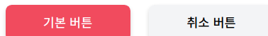

# CSS 방법론

발표자: FE 동동

# 1. CSS 정의 및 역할

- CSS는 Cascading Style Sheets의 약자
- 정의: HTML 또는 XML로 쓰여진 문서의 스타일을 나타내기 위해 사용되는 언어
- 역할: HTML이나 XML의 각 요소를 꾸미는 것이며, 문서의 구조와 스타일(디자인)을 분리

# 2. CSS 이전의 스타일링과 이후의 스타일링

## CSS 등장 이전

```html
<!-- index.html -->

<p style="color: #f00; font-size: 18px">
  이 텍스트는 18px 의 빨간 문자로 표시됩니다
</p>
```

- CSS가 등장하기 전에는 스타일을 각 요소(font 요소 등)의 전용 속성이나 style 속성으로 일일이 지정했습니다.
- 같은 스타일 요소를 여러 페이지마다 사용하려면 수정할 때 그만큼 반복 수정을 해야
  한다.
- HTML이나 XML은 본래 문서 구조를 의미하므로 스타일을 지정하는 것은 바람직하지
  않다

## CSS 등장 이후

```css
/* index.css */

p {
  color: #f00;
  font-size: 18px;
}
```

```html
<!-- index.html -->

<p>이 텍스트는 18px 의 빨간 문자로 표시됩니다</p>
```

# 3. CSS의 특징: Inherited globally

### CSS는 모든 것이 전역이다.

- CSS에서는 모든 것이 전역 범위다. 모든 스타일링이 서로 간섭할 가능성이 있다.
- CSS파일이 분리되어 있다 하더라도 이 파일들을 읽어 들인 HTML/XML 에서는 모든 스타일링이 동일한 범위 안에 존재하게 된다.
- JS 도 ES2015 가 되어서야 module system 이 도입되었다. 그 이전에는 서로 다른 스크립트 내의 변수들이 전역에서 공유되었다는 점을 생각해보면 CSS가 global scope 인 것은 놀랍지 않다.
- 만들어졌을 때에는 복잡한 웹사이트가 없었다. 일관된 스타일을 유지하기 위해 상위에서 정의한 색상, 글꼴, 사이즈, 너비, 레이아웃 등이 상속되는 것은 매우 효과적인 방법이었을 것이다.
- 하지만, 웹사이트가 점점 복잡해지면서 유지보수성이 높게 CSS 를 작성하는 것이 어려워졌고, 이에 대한 방법론이 여러 가지 대두되었다.

# 4. CSS의 특징: Cascading

- Cascading: 셀렉터가 가리키는 동일 요소의 같은 속성에 다른 값을 설정한 경우, 최종적으로 어떤 값을 적용할지에 관한 규칙으로 다음 우선순위에 따라 적용할 스타일이 결정됩니다.

  1. 중요도: !important : !important 를 쓰면 가장 우선순위가 높는다.
  2. 상세도

     1. ID 셀렉터: #id
     2. 클래스 셀렉터 / 속성 셀렉터 / 의사 클래스: .class , [name="input"], :first-child
     3. 요소형 셀렉터(의사 요소): ::before

     요소 셀렉터 < 클래스 셀렉터 < 속성 셀렉터 < 의사 클래스 < ID 셀렉터

  3. 코드 순서: 동일한 우선순위인 경우에는 나중에 정의한 항목이 적용된다

# 5. 좋은 CSS 설계

1. 예측가능하다 .
2. 재사용가능하다.
3. 유지보수가능하다.
4. 확장가능하다

⇒ 이를 달성하기 위한 CSS 설계 방법으로 다양한 CSS 방법론(methodologies)가 주장되었다

# 6. OOCSS

## 6-1. OOCSS란

- Object Oriented CSS: 객체 지향 CSS

1. 레고처럼 자유로운 조합이 가능한 모듈의 집합을 만든다
2. 그 모듈을 조합해 페이지를 만든다.
3. 그리하여 신규 페이지를 만드는 경우에도 기본적으로 추가적인 CSS를 만들 필요가 없다.

위와 같은 발상으로 제창된 OOCSS 는 다른 CSS 설계 기법에도 조금씩 영향을 주었습니다.

이 레고와 같은 모듈을 구현하기 위한 구체적인 수법으로 다음 두 가지 원칙을 들 수 있습니다.

## 6-2. OOCSS의 두 가지 원칙

1. 스트럭처(구조)와 스킨(화면) 분리
2. 컨테이너와 콘텐츠 분리

## 6-3. 스트럭처(구조)와 스킨(화면) 분리



```html
<main id="main">
  <button class="btn-general">기본 버튼</button>
  <button class="btn-warning">취소 버튼</button>
</main>
```

```css
#main .btn-accept {
  width: 10rem;
  max-width: 100%;
  padding: 0.75rem;
  font-weight: 500;
  background-color: rgb(244, 63, 94);
  color: white;
  box-shadow: 0 3px 6px rgb(0 0 0 / 16%);
  font-size: 1rem;
  line-height: 1.5rem;
  text-align: center;
  border-radius: 0.5rem;
  border: none;
}

#main .btn-cancel {
  width: 10rem;
  max-width: 100%;
  padding: 0.75rem;
  font-weight: 500;
  background-color: rgb(243, 244, 246);
  color: black;
  box-shadow: 0 3px 6px rgb(0 0 0 / 16%);
  font-size: 1rem;
  line-height: 1.5rem;
  text-align: center;
  border-radius: 0.5rem;
  border: none;
}
```

스트럭처에 해당하는 속성은 크게 다음과 같습니다.

- width
- height
- padding
- margin

스킨에 해당하는 속성은 크게 다음과 같습니다.

- color
- font
- background
- box-shadow
- text-shadow

위와 같이 구분할 수 있지만 OOCSS 에서는 명확하게 결정되어 있는 것은 아닙니다. 이 부분은
너무 이론에 얽매이지 말고 경우에 따라 적절하게 분류하는 방법을 사용해도 무방합니다

## 손쉽게 에러 버튼의 추가가 가능하다


```css
/* 스트럭쳐 */
#main .btn {
  width: 10rem;
  max-width: 100%;
  /* ... 중략 */
}

/* 스킨 */
#main .accept {
  background-color: rgb(244, 63, 94);
  color: white;
}

#main .cancel {
  background-color: rgb(243, 244, 246);
  color: black;
}

#main .danger {
  background-color: rgb(176, 0, 32);
  color: white;
}
```

## 6-4. 컨테이너와 콘텐츠 분리

특정한 콘텍스트에 지나치게 의존하지 않는다.

현재 컨테이너는 대략 ‘영역’, 콘텐츠는 바로
앞절에서 본 ‘버튼’ 모듈을 생각하면 됩니다. 예를 들어, 바로 앞의 예시에서는 버튼 모듈은 id 속성에 ‘ main ’이 지정된 main 요소 안에 포함되어 있습니다

이 상태에서는 버튼을 main 밖에서 사용하려 해도 그럴 수 없습니다. 이 문제에 대한
해결 방법은 매우 간단합니다. 버른 모듈을 main 밖에서도 동작하도록 CSS 셀렉터를 수정합
니다. 컨테이너와 콘덴츠의 분리라는 것은 다시 말해 ‘모듈을 가능한 특정한 영역에 의존하지
않도록 한다’는 지침을 의미합니다

```css
/* 컨테이너 */
#main {
  display: grid;
  place-items: center;
  padding: 1rem;
}

/* 컨텐츠 */
.btn {
  width: 10rem;
  max-width: 100%;
  padding: 0.75rem;
  font-weight: 500;
  box-shadow: 0 3px 6px rgb(0 0 0 / 16%);
  font-size: 1rem;
  line-height: 1.5rem;
  text-align: center;
  border-radius: 0.5rem;
  border: none;
}

.accept {
  background-color: rgb(244, 63, 94);
  color: white;
}

.cancel {
  background-color: rgb(243, 244, 246);
  color: black;
}

.danger {
  background-color: rgb(176, 0, 32);
  color: white;
}
```

## 6-5. OOCSS 정리

o o c s s 의 역사는 매우 길며 명확하게 규칙이라고 불리는 것도 많지 않습니다(공식 사이트를 보면 알 수 있지만 설명도 매
우 간략합니다). 사실 이제부터 설명할 css 설계 기법들은 기본적으로 크건 작건 o o c s s 를 참조하면서 개선을 한 것입니다.

오늘날 OOCSS 한 가지만으로 실질적인 CSS 설계를 수행하는 것은 그다지 현실적이지 않습니다.
그러나 10년 전 제창한 사고방식이 다른 CSS 설계 기법에 녹아들어，지금까지도 사용되는 것을 생각하면 OOCSS 가 표방했던 사고는 CSS 설계에 있어 ‘하나의 진리’라고 해도 과언이 아니
라고 생각합니다. OOCSS 는 CSS 설계의 기초 중의 기초이므로 이 내용들을 꼭 기억해 두시기 바랍니다.

# 7. SMACSS

## 7-1. SMACSS란?

- Scalable and Modular Architecture for CSS
- 조나단 스눅 Owwthan Snook)이 제창
- CSS를 위한 확장 가능한 모듈 아키텍쳐
- CSS 코드를 그 역할에 따라 분류한 것이 특징
  1. 베이스(Base)
  2. 레이아웃(Layout)
  3. 모듈(Module)
  4. 스테이트(State)
  5. 테마(Theme)

⑴ CSS에서 말한 범위는 SMACSS의 ‘모듈’과 거의 비슷합니다. OOCSS가 거의 모듈만 언급
했던 것에 비해 SMACSS는 보다 폭넓고 실제로 웹사이트를 구축하는 데 있어 빼놓을 수 없는
베이스나 레이아웃 코드를 다루는 방법까지 설명하고 있습니다.

## 7-2. 베이스(Base)

프로젝트의 표준 스타일을 정의. 리셋 CSS도 베이스 규칙에 포함됨.

```css
body {
  background-color: #fff;
}

a:hover {
  text-decoration: none;
}
```

## 7-3. 레이아웃(Layout)

- 레이아웃 규칙은 헤더나 메인 영역，사이드 바，푸터 등 웹사이트의 큰 틀을 구성하는 큰 모듈 에 관한 규칙
- 레이아웃을 구성하는 것의 대부분은 특정 페이지에서 한 차례만 사용되
  는 것이 많 으므로,
  ID 셀렉터를 활용한 스타일링을 허용합니다.
- 레이아웃과 관련해서 반복적
  사용하는 모듈의 경우에는 클래스 셀렉터를 이용합니다.

---

```css
/* ID 셀렉터 예시*/
#header {
  width: 1080px;
  margin-right: auto;
  margin-left: auto;
  background-color: #fff;
}
#main {
  width: 1080px;
  margin-right: auto;
  margin-left: auto;
  background-color: #fff;
}
#footer {
  width: 1080px;
  margin-right: auto;
  margin-left: auto;
  background-color: #eee;
}

/* 클래스 셀렉터 예시 */
.section {
  padding-top: 80px;
  padding-bottom: 80px;
}
```

---

### 특정한 상황에서만 Layout을 변경하고 싶은 경우

예를 들어, ‘특정한 페이지에서는 가로 폭을 좁히고 싶은 경우에는 손자 셀렉터를 이용해 레이
아웃 모듈의 스타일을 덮어쓸 수 있습니다. 다음 코드에서는 body 요소에 .1-n a rro w 클래스
를 붙여서 손자 셀렉터를 사용해 헤더，메인 영역, 푸터의 가로 폭을 좁혔습니다

---

```html
<body class="l-narrow">
  <header id="header">
    <!--  -->
  </header>
  <main id="main">
    <!--  -->
  </main>
  <footer id="footer">
    <!--  -->
  </footer>
</body>
```

```css
.l-narrow #header {
  width: 960px;
}

.l-narrow #main {
  width: 960px;
}

.l-narrow #footer {
  width: 960px;
}
```

## 7-4. 모듈 규칙

- 모든 모듈은 레이아웃 규칙 안에 배치되는 것을 가정
- 다른 페이지로 이동하거나 다른 레이아웃 안에 삽입하더라도 형태가 부서지거나 달라지지 않고 사용할 수 있어야 합니다
  - ‘이 코드는 다른 레이아웃으로 이동했을 때 영향이 없는가 고려
- 한 페이지 내에서 반복해서 사용되는 상황을 가정하고 있으므로 당연히 ID 셀렉터에서의 구현은 하지 않으며. 모듈의 루트 요소에는 반드시 클래스 셀렉터 (HTML 에서는 클래스 속성)를 사용합니다.

### 주의사항

- 가급적 요소형 셀렉터를 사용하지 않는다.
  -> HTML과 스타일링을 느슨하게 결합한다
  - 요소형 셀렉터를 쓰는 경우 손자 셀렉터가 아닌 자녀 셀렉터(>)를 사용하여 영향 범위를 지나치게 넓히지 않는다.
- 특정한 콘텍스트에 지나치게 의존하지 않는다.

---

### 가급적 요소형 셀렉터를 사용하지 않는다.

```html
<>
```

```css

```

# 8. BEM

## 8-1. BEM이란?

- Block, Element, Modifier
- 러시아의 Yandex 사가 제창
- 목적: 사용자 인터페이스를 독립된 블록으로 분리함으로써 복잡한 페이지에서도 간단하고 신속하게 개발을 수행
- 기본적으로는 모듈 기반의 방법이지만，그 내용이 다른 설계 기법에 비해 엄격하고 강력
- 모듈을 Block, Element, Modifier 단위로 분해 및 정의합니다.

## 8-2.

# 9. TailwindCSS

don't write CSS.

use utility class

# 10. Reference

- CSS 설계 실전 가이드
- [http://oocss.org/](http://oocss.org/)
- [https://www.slideshare.net/stubbornella/object-oriented-css/22-Components_are_like_legos](https://www.slideshare.net/stubbornella/object-oriented-css/22-Components_are_like_legos)

# 11. Any Questions?
