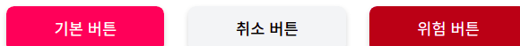

# CSS 방법론

FE 동동

<!-- 안녕하세요 CSS 방법론이라는 주제로 오늘 발표를 하게 된 우아한테크코스 프론트엔드 3기 동동입니다. -->

# 순서

1. CSS란?
2. CSS 등장 이전/이후의 스타일링
3. CSS의 문제점
4. OOCSS
5. SMACSS
6. BEM
7. 새로운 CSS 방법론

<!-- 먼저 오늘 발표의 순서는 다음과 같습니다.
CSS가 무엇인지 살펴본 후, CSS 등장 이전과 이후의 스타일링을 비교해보겠습니다. 다음 CSS의 문제점과 이를 해결하기 위하여 대두된 CSS 방법론들을 살펴보겠습니다.
-->

# 1. CSS란?

- HTML 또는 XML로 쓰여진 문서의 스타일을 나타내기 위해 사용되는 언어
- 문서의 구조와 스타일(디자인)을 분리하여 HTML이나 XML의 각 요소를 꾸미는 것이 역할

<!-- CSS는 HTML 또는 XML로 쓰여진 문서의 스타일을 나타내기 위해 사용되는 언어로서, HTML로 표현되는 문서의 구조와 디자인적인 요소를 분리하여 HTML이나 XML의 각 요소를 꾸미는 것이 CSS의 역할입니다. -->

# 2. CSS 등장 이전/이후의 스타일링

<!--  CSS 등장 이전/이후의 스타일링 방법의 차이를 보면 CSS의 역할에 대한 이해에  조금 더 도움이 될 것 같습니다.  -->

## 2-1. CSS 등장 이전

각 요소의 전용 속성이나 `style` 속성으로 스타일을 일일이 지정

```html
<font color="#00f"> 이 텍스트는 파란색으로 표시됩니다. </font>

<p style="color: #f00; font-size: 18px">
  이 텍스트는 18px 의 빨간 문자로 표시됩니다
</p>
```

### 문제점

- 같은 스타일 요소를 여러 페이지마다 사용하면, 하나를 수정할 때마다 그만큼 반복하여 수정을 해야 한다
- HTML은 본래 문서 구조를 의미하므로 HTML에 직접 스타일을 지정하는 것은 바람직하지 않다

<!--
 CSS가 등장하기 이전에는 각 HTML 요소의 전용 속성이나 style속성으로 스타일을 일일이 지정하여야 했습니다.
 예를 들어, font 요소의 color 속성에 hex 코드를 넣어 색상 스타일을 부여하거나 각 요소의 style 속성에 inline으로 스타일을 기재하여야 했습니다.
이러한 방법은, 같은 스타일 요소를 여러 페이지마다 사용하면, 하나를 수정할 때마다 그만큼 반복하여 수정을 해야 한다는 문제점과,
HTML은 본래 문서 구조를 의미하므로 HTML에 직접 스타일을 지정하는 것은 바람직하지 않다는 문제점이 있습니다.

 -->

## 2-2. CSS 등장 이후

```css
/* index.css */

p {
  color: #f00;
  font-size: 18px;
}
```

```html
<!-- index.html -->

<p>이 텍스트는 18px 의 빨간 문자로 표시됩니다</p>
```

<!--  css 등장 이후에는
css 파일에는 스타일을 기재하고
html에는 문서의 구조를 작성하게 되어,
관심사의 분리가 이루어지게 되었습니다.
또한, css는 기본적으로 전역 범위이므로
한 번 p 요소에 스타일을 부여하면 여러 페이지에서도 동일하게 적용됩니다.
만약 p 요소의 스타일을 수정하는 경우에도 한 곳만 수정하면 여러 페이지에도 수정된 내용이 적용되어 반복수정을 피할 수 있게 되었습니다. -->

# 3. CSS의 문제점

- CSS에서는 모든 것이 전역 범위이므로, 모든 스타일링이 서로 간섭할 가능성이 있다

- CSS파일이 분리되어 있다 하더라도 이 파일들을 읽어 들인 HTML 에서는 모든 스타일링이 동일한 범위 안에 존재하게 된다

- 웹사이트가 점점 복잡해지면서 유지보수가 용이한 CSS 를 작성하는 것이 어려워졌고, 이를 해결하기 위한 CSS 방법론이 여러 가지 대두되었다

<!--
CSS 의 등장으로 마치 문제가 모두 해결된 듯 싶었습니다.
‘문서 구조와 스타일을 분리한다’는 점에 있어서는 확실히 성공했지만,
막상 현실에서는 다른 문제가 나타났습니다.
CSS에서는 모든 것이 전역 범위이므로,
모든 스타일링이 서로 간섭할 가능성이 있어,
‘페이지 수가 늘어남에 따라 CSS 가 점점 복잡해지고 관리하기 어렵다’ 는 문제점입니다.

웹사이트가 점점 복잡해지면서 유지보수가 용이한 CSS 를 작성하는 것이 어려워졌고, 이를 해결하기 위한 CSS 방법론이 여러 가지 대두되었습니다.

-->

# 4. OOCSS

<!-- 첫번째로 말씀드릴 CSS방법론은 OOCSS 입니다. -->

## 4-1. OOCSS란

- Object Oriented CSS: 객체 지향 CSS
- 니콜 설리번(Nicole Sullivan)이 제창
- 주요 발상

  1. 레고처럼 자유로운 조합이 가능한 모듈의 집합을 만든다
  2. 그 모듈을 조합해 페이지를 만든다
  3. 그리하여 신규 페이지를 만드는 경우에도 기본적으로 추가적인 CSS를 만들 필요가 없다

<!--
  OOCSS는 Object Oriented CSS의 약자로, 객체 지향 CSS를 나타내며
  니콜 설리번(Nicole Sullivan)이 다음과 같은 발상으로 제창하였습니다.
  1번. 레고처럼 자유로운 조합이 가능한 모듈의 집합을 만든다
  2번. 그 모듈을 조합해 페이지를 만든다
  3번. 그리하여 신규 페이지를 만드는 경우에도 기본적으로 추가적인 CSS를 만들 필요가 없다
-->

---

### 레고와 같은 모듈을 구현하기 위한 두 가지 원칙

1. 스트럭처(구조)와 스킨(화면) 분리
2. 컨테이너와 콘텐츠 분리

<!--

이 레고와 같은 모듈을 구현하기 위한 구체적인 수법으로 다음 두 가지 원칙을 들 수 있습니다.
1번 스트럭처와 스킨의 분리
2번 컨테이너와 콘텐츠 분리
-->

## 4-2. 스트럭처(구조)와 스킨(화면) 분리

### 스트럭처와 스킨 분리 전


```html
<main id="main">
  <button class="btn-accept">기본 버튼</button>
  <button class="btn-cancel">취소 버튼</button>
</main>
```

<!--
스트럭처와 스킨 분리를 살펴보겠습니다.
다음과 같은 기본 버튼과 취소 버튼을 스타일해야한다고 가정해보겠습니다.
그러면 가장 손쉽게 생각나는 방법은 다음과 같이 html과 css를 작성하는 것입니다.

main은 페이지 내에서 유일한 것으로 가정하여, id속성을 main으로 주었습니다.
각 버튼에는 btn-accept, btn-cancel이라는 클래스명을 부여하였습니다.
 -->

---

```css
#main .btn-accept {
  width: 10rem;
  max-width: 100%;
  padding: 0.75rem;
  font-weight: 500;
  background-color: rgb(244, 63, 94);
  color: white;
  box-shadow: 0 3px 6px rgb(0 0 0 / 16%);
  font-size: 1rem;
  line-height: 1.5rem;
  text-align: center;
  border-radius: 0.5rem;
  border: none;
}

#main .btn-cancel {
  width: 10rem;
  max-width: 100%;
  padding: 0.75rem;
  font-weight: 500;
  background-color: rgb(243, 244, 246);
  color: black;
  box-shadow: 0 3px 6px rgb(0 0 0 / 16%);
  font-size: 1rem;
  line-height: 1.5rem;
  text-align: center;
  border-radius: 0.5rem;
  border: none;
}
```

<!-- 각 버튼을 나타내기 위한 CSS는 다음과 같을 것입니다.

기본 버튼과 취소 버튼에 대한 css를 보면 공통적인 부분이 굉장히 많은 것이 보이실 것입니다.

일반적으로 스트럭처에 해당하는 속성은

- width
- height
- padding
- margin

등 입니다.

스킨에 해당하는 속성은
- color
- font
- background
- box-shadow

등 입니다.

이와 같이 일반적으로 구분할 수 있지만 OOCSS 에서는 스트럭처와 스킨의 구분이 명확하게 결정되어 있는 것은 아닙니다.

따라서 공통적인 부분을 스트럭처에 해당한다고 보고, 스트럭처와 스킨을 분리해보도록 하겠습니다.
 -->

---

### 스트럭처와 스킨 분리 후

```css
/* 스트럭쳐 */
#main .btn {
  width: 10rem;
  max-width: 100%;
  /* ... 중략 */
}

/* 스킨 */
#main .accept {
  background-color: rgb(244, 63, 94);
  color: white;
}

#main .cancel {
  background-color: rgb(243, 244, 246);
  color: black;
}
```

<!--
공통된 부분을 스트럭처로 분리하고, 각 버튼마다 다른 부분인 color와 background-color를 스킨으로 분리하였습니다.

보기에는 확실히 깔끔해진 것 같습니다. 그럼 유지보수시에는 어떤 이점이 있을까요?

 -->

---

### 위험 버튼 추가



```html
<main id="main">
  <button class="btn accept">기본 버튼</button>
  <button class="btn cancel">취소 버튼</button>
  <button class="btn danger">위험 버튼</button>
</main>
```

```css
#main .danger {
  background-color: rgb(176, 0, 32);
  color: white;
}
```

<!-- 유지보수중 배경색이 빨간색이고 글자색이 하얀색인 위험 버튼을 추가해야 하는 상황이 되었습니다. 기존에 스트럭처와 스킨을 분리하기 이전에는 위험 버튼에 대한 모든 css 속성을 정의하였어야 하나, 스트럭처와 스킨을 분리한 이후에는
공통된 속성이 정의된 btn 스트럭처를 그대로 사용하며 danger 클래스를 추가하여 새로운 css속성만을 정의하여 위험 버튼을 구현할 수 있습니다.

즉 중복을 피하면서 간단하게 위험 버튼을 추가할 수 있습니다. -->

## 4-3. 컨테이너와 콘텐츠 분리

- 컨테이너는 '영역', 콘텐츠는 '모듈'

- 특정한 컨텍스트에 지나치게 의존하지 않는다

```html
<!-- 컨테이너 -->
<main id="main">
  <!-- 콘텐츠 -->
  <button class="btn accept">기본 버튼</button>
  <!-- 콘텐츠 -->
  <button class="btn cancel">취소 버튼</button>
  <!-- 콘텐츠 -->
  <button class="btn danger">위험 버튼</button>
</main>
```

---

<!--
다음으로 컨테이너와 콘텐츠 분리에 대해 알아보겠습니다.
컨테이너는 ‘영역’, 콘텐츠는 '모듈'을 의미합니다. 바로 앞의 예시에서는 id 속성에 ‘ main ’이 지정된 main 요소가 컨테이너이며, 버튼이 모듈에 해당합니다.
버튼 모듈은 메인 컨테이너 안에 포함되어 있어, 버튼을 main 밖에서 사용하려 해도 그럴 수 없습니다. 즉, main 이라는 특정 컨택스트에 의존적입니다. 이 문제에 대한 해결 방법은 매우 간단합니다.
 -->

```css
/* 컨테이너 */
#main {
  display: grid;
  place-items: center;
  padding: 1rem;
}

/* 컨텐츠 */
/* ❌ #main .btn { */
.btn {
  width: 10rem;
  max-width: 100%;
  padding: 0.75rem;
  font-weight: 500;
  box-shadow: 0 3px 6px rgb(0 0 0 / 16%);
  font-size: 1rem;
  line-height: 1.5rem;
  text-align: center;
  border-radius: 0.5rem;
  border: none;
}
```

<!-- 버튼 모듈을 main 밖에서도 동작하도록 CSS 셀렉터를 수정하는 것입니다.
컨테이너와 콘덴츠의 분리라는 것은 다시 말해
‘모듈을 가능한 특정한 영역에 의존하지 않도록 한다’는 지침을 의미합니다 -->

## 4-4. OOCSS 정리

- OOCSS의 역사는 매우 길며 명확하게 규칙이라고 불리는 것도 많지 않다

- 다른 CSS 방법론들은 기본적으로 크건 작건 OOCSS를 참조하면서 개선한 것

- 오늘날 OOCSS 한 가지만으로 실질적인 CSS 설계를 수행하는 것은 그다지 현실적이지 않음

<!--
OOCSS의 역사는 매우 길며 명확하게 규칙이라고 불리는 것도 많지 않습니다.
공식 사이트를 보면 알 수 있지만 설명도 매우 간략합니다.

오늘날 OOCSS 한 가지만으로 실질적인 CSS 설계를 수행하는 것은 그다지 현실적이지 않습니다.

다만 10년 전 제창한 사고방식이 다른 CSS 설계 기법에 녹아들어 지금까지도 사용되는 것을 생각한다면, OOCSS가 표방한 사고는 CSS 설계에 있어 '하나의 진리'라고 해도 과언이 아니라고 생각됩니다.
 -->

# 5. SMACSS

<!-- 다음 말씀드릴 CSS 방법론은 스맥스입니다. -->

## 5-1. SMACSS란?

- Scalable and Modular Architecture for CSS
- 조나단 스눅 (Jonathan Snook)이 제창

- CSS 코드를 그 역할에 따라 분류한 것이 특징
  1. 베이스(Base)
  2. 레이아웃(Layout)
  3. 모듈(Module)
  4. 스테이트(State)
  5. 테마(Theme)

<!--
SMACSS는 Scalable and Modular Architecture for CSS의 머리글자로서, 조나단 스눅 (Jonathan Snook)이 CSS를 위한 확장 가능한 모듈 아키텍쳐를 지향하며 제창하였습니다.

SMACSS는 CSS코드를 그 역할에 따라 아래와 같이 5가지로 분류한 것이 큰 특징입니다.

OOCSS는 SMACSS를 기준으로 보았을 때 거의 모듈만 언급했던 것에 비해 SMACSS는 보다 폭넓고 실제로 웹사이트를 구축하는 데 있어 빼놓을 수 없는 베이스나 레이아웃 코드를 다루는 방법까지 설명하고 있습니다.
-->

## 5-2. 베이스(Base) 규칙

- 프로젝트의 표준 스타일을 정의
- 리셋 CSS, 도 베이스 규칙에 포함됨

```css
body {
  background-color: #fff;
}

a:hover {
  text-decoration: none;
}
```

<!-- 베이스 규칙은 프로젝트의 표준 스타일을 정의하는 코드 규칙입니다. 베이스에 해당하는 규칙은 바탕화면 색깔 등 프로젝트 전반에 적용되는 스타일링입니다. 또한, 브라우저간 차이를 제거하기 위해 사용되는 리셋 CSS, 노멀라이즈 CSS 도 SMACSS 기준 베이스 규칙에 해당합니다. -->

## 5-3. 레이아웃(Layout) 규칙

- 헤더, 메인 영역，사이드 바 등 웹사이트의 레이아웃을 구성하는 큰 모듈에 관한 규칙

- 대부분 특정 페이지에서 한 차례만 사용하므로 ID 셀렉터를 활용한 스타일링을 허용

- 반복적으로 사용하는 모듈의 경우에는 클래스 셀렉터를 이용

```html
<header id="header">This is Header</header>
<main id="main">
  This is Main
  <section class="section">Section 1</section>
  <section class="section">Section 2</section>
  <section class="section">Section 3</section>
</main>

<footer id="footer">This is Footer</footer>
```

<!-- 다음은 레이아웃 규칙입니다. 레이아웃 규칙은 헤더나 메인 영역, 사이드 바, 푸터 등 웹사이트의 레이아웃을 구성하는 큰 모듈에 관한 규칙입니다.
레이아웃을 구성하는 것의 대부분은 특정 페이지에서 한 차례만 사용되는 것이 많으므로, ID 셀렉터를 허용합니다.
레이아웃과 관련해서 반복적으로 사용하는 모듈의 경우에는 클래스 셀렉터를 이용합니다.-->

---

```css
/* ID 셀렉터 예시*/
#header {
  width: 1080px;
  margin-right: auto;
  margin-left: auto;
  background-color: #fff;
}

#main {
  width: 1080px;
  margin-right: auto;
  margin-left: auto;
  background-color: #fff;
}

#footer {
  width: 1080px;
  margin-right: auto;
  margin-left: auto;
  background-color: #eee;
}

/* 클래스 셀렉터 예시 */
.section {
  padding-top: 80px;
  padding-bottom: 80px;
}
```

---

### 특정한 페이지에서만 레이아웃을 변경하고 싶은 경우

- 손자 셀렉터를 이용해 레이아웃 모듈의 스타일을 덮어씀

```html
<body class="l-narrow">
  <header id="header"></header>
  <main id="main"></main>
  <footer id="footer"></footer>
</body>
```

```css
.l-narrow #header,
.l-narrow #main,
.l-narrow #footer {
  width: 960px;
}
```

<!--
만약 특정한 페이지에서만 레이아웃을 변경하고 싶으면 어떻게 해야 할까요?

예를 들어, ‘특정한 페이지에서는 가로 폭을 좁히고 싶은 경우', SMACSS에서는 손자 셀렉터를 이용해 레이아웃 모듈의 스타일을 덮어쓸 것을 권장하고 있습니다. 다음 코드에서는 body 요소에 l-narrow 클래스를 붙인 후 각 레이아웃 모듈에 대한 손자 셀렉터를 사용해 헤더，메인 영역, 푸터의 가로 폭을 좁혔습니다 -->

## 5-4. 모듈(Module) 규칙

- 타이틀(Title), 버튼(Button), 카드(Card), 내비게이션(Navigation) 등

- 모든 모듈은 레이아웃 규칙 안에 배치되는 것을 가정

- 다른 페이지로 이동하거나 다른 레이아웃 안에 삽입하더라도 형태가 부서지거나 달라지지 않고 사용할 수 있어야 함

  - 특정 컨텍스트에 지나치게 의존하지 않도록 작성하여야 함

  <!--
  다음은 모듈 규칙입니다. 모듈은 타이틀, 버튼, 카드, 내비게이션 등 일반적인 UI 컴포넌트를 나타냅니다.
  모든 모듈은 레이아웃 규칙 안에 배치되는 것을 가정합니다. 다른 페이지로 이동하거나 다른 레이아웃 안에 삽입하더라도 형태가 부서지거나 달라지지 않고 사용할 수 있어야 합니다. 따라서 모듈 규칙을 작성할 때에는 다른 레이아웃으로 이동했을 때 영향이 없는가를 고려하여야 합니다. 즉, 특정한 컨텍스트에 지나치게 의존하지 않도록 작성하여야 합니다.
  -->

---

- 모듈의 루트 요소에는 반드시 클래스 셀렉터를 사용

```html
<div class="media">
  <figure>
    <p>무야호~</p>
    <!-- 생략 -->
  </figure>
</div>
```

```css
.media {
  /* 중략 */
}

/* ❌ 손자 셀렉터 .media figure  */
/* ✅ 자녀 셀렉터 .media > figure */
.media > figure {
  /* 중략 */
}
```

<!--
또한 모듈은 한 페이지 내에서 반복해서 사용되는 상황을 가정하고 있으므로 당연히 ID 셀렉터를 이용한 구현은 하지 않으며. 모듈의 루트 요소에는 반드시 클래스 셀렉터를 사용합니다.

모듈의 하위 요소에는 요소 셀렉터를 사용할 수 있으나, HTML과 스타일링을 느슨하게 결합하기 위해서 가급적 요소 셀렉터를 사용하지 않을 것을 권장하고 있습니다.
만약 요소형 셀렉터를 사용하는 경우, ㅇ시맨틱 요소를 사용할 것과 손자 셀렉터가 아닌 자녀 셀렉터(>)를 사용하여 영향 범위를 지나치게 넓히지 않아야 합니다.
 -->

## 5-5. 스테이트(State) 규칙

- 기존 스타일을 덮어쓰거나 확장하기 위해 사용

- 기존 스타일을 모두 덮어써서 스테이트 스타일을 반영하는 것을 기대하기 때문에 필요한 경우에는 `!important` 사용도 권장

- 스테이트는 레이아웃이나 모듈에 할당할 수 있다

- 스테이트 규칙에 따른 클래스 이름은 모두 `is-` 접두사를 붙인다

<!--
다음은 스테이트 규칙입니다. 스테이트 규칙은 기존 스타일을 덮어쓰거나 확장하기 위해 사용합니다.

 기존 스타일을 모두 덮어써서 스타일을 반영하는 것을 기대하기 때문에 필요한 경우에는 `!important` 사용도 권장하고 있습니다.

스테이트는 레이아웃, 모듈 모두에 할당할 수 있습니다.

스테이트의 이름에 is 접두사를 붙여서 다른 규칙과 구별하며, 어떤 모듈에 적용하는지를 명확하게 하기 위해서 스테이트의 이름에 모듈 이름을 포함시킬 것을 권장하고 있습니다.

 -->

---

- 자바스크립트에 의존한다

  

```css
.is-tab-active {
  background-color: blue;
  color: white;
}
```

```js
document.querySelector(".tab").addEventListener("click", (event) => {
  event.target.classList.toggle("is-tab-active");
});
```

<!--

 레이아웃, 모듈과 스테이트를 구분하는 쉬운 방법은 스테이트는 자바스크립트에 의존한다는 점입니다.

탭1 탭2 탭3 탭4가 있는 이러한 모듈에서, 각 탭을 클릭하면 배경색이 파란색으로 바뀐다고 가정해보겠습니다.
자바스크립트로 각 탭의 click event handler를 이용하여 배경색을 바꾸는 클래스를 추가하여 구현할 때, 배경색을 바꾸는 클래스,is-tab-active가 바로 스테이트 규칙에 해당하는 css 코드입니다.
 -->

## 5-6. 테마(Theme) 규칙

- 사이트 내 레이아웃이나 색상, 텍스트 처리 등을 일정한 규칙에 따라 덮어쓰는 것

- 기존의 다양한 스타일링이 덮어쓰기의 대상이 된다.

- 예시) 다크모드 전환, 테마 컬러 변경 등

- `theme` 접두사를 붙일 것을 권장

<!-- 마지막 규칙은 테마 규칙입니다. 테마 규칙은 사이트 내 레이아웃이나 색상, 테스트 처리 등을 일정한 규칙에 따라 덮어쓰는 것으로서, 기존의 다양한 스타일링이 덮어쓰기의 대상이 됩니다. 테마 규칙은 다크모드 전환을 떠올리면 이해하기 쉽습니다.
  -->

## 5-7. SMACSS 정리

- 프로젝트에서 고려해야 하는 대부분의 CSS 규칙을 포함

- 각 규칙이 엄격하지 않아 유연하나, 경우에 따라 규칙이 너무 유연하여 실제 코드의 지침으로 삼기 어려움

- 모듈 규칙에 OOCSS를 적용하거나 다음에 설명할 BEM의 규칙을 일부 적용하는 등 다른 설계 기법과 조합하는 경우가 많다

<!--
SMACSS는 프로젝트에서 고려해야 하는 대부분의 CSS 규칙을 가지고 있습니다.

각 규칙이 그렇게 엄격하지는 않으며 어느 정도 유연함을 발휘하므로 비교적 느슨한 개발을 하는 경우에 적합합니다.

다만 경우에 따라서는 규칙이 너무 유연해서 실제 코드의 지침으로 삼기 어려운 경우도 있습니다.

그때는 모듈 규칙에 OOCSS를 적용하거나 다음에 설명할 BEM의 규칙을 일부 적용하는 등 다른 설계 기법과 조합하는 경우도 많습니다.


-->

# 6. BEM

<!-- 다음으로 말씀드릴 CSS 방법론은 BEM입니다. -->

## 6-1. BEM이란?

- Block, Element, Modifier
- 러시아의 Yandex 사가 제창한 컴포넌트 기반 웹 개발 접근법
- UI를 독립된 블록으로 분리함으로써 복잡한 페이지에서도 간단하고 신속하게 개발을 수행하는 것이 목적
- 기본적으로는 모듈 기반의 방법이지만，그 내용이 다른 설계 기법에 비해 엄격하고 강력하여 세계적으로 이름이 알려졌으며 실제로 널리 사용되고 있다

<!-- BEM은 Block, Element, Modifier의 머리글자로서, 러시아의 Yandex 사가 제창한 컴포넌트 기반 웹 개발 접근법입니다.
UI를 독립된 블록으로 분리함으로써 복잡한 페이지에서도 간단하고 신속하게 개발을 수행하는 것을 목적으로 합니다.
기본적으로는 모듈 기반의 방법이지만，그 내용이 다른 설계 기법에 비해 엄격하고 강력하여 세계적으로 이름이 알려졌으며 실제로 널리 사용되고 있습니다.
-->

## 6-2. Block

- 재사용할 수 있는 기능적으로 독립적인 페이지 구성요소

- BEM을 사용할 때는 ID 셀렉터 또는 요소 셀렉터를 사용하면 안 됨

- Block 이름은 상태(`state`)가 아닌 용도(`purpose`)를 나타낸다

  - ✅ "이것은 무엇인가?" — menu or button
  - ❌ "이것은 어떻게 생겼는가?" — red or big

```html
<!-- ✅ error 블록은 시맨틱한 의미를 가지고 있습니다.  -->
<div class="error"></div>

<!-- ❌ red-text는 글자가 빨갛다는 상태를 나타냅니다 -->
<div class="red-text"></div>
```

<!-- 먼저 Block에 대해 살펴보겠습니다. Block은 재사용할 수 있는 기능적으로 독립된 페이지 구성요소입니다. HTML에서 Block은 클래스 속성으로 나타냅니다. 즉, CSS에서는 클래스 셀렉터를 사용합니다.
이는 상세도를 가능한 균일하게 유지하려는 것이며, 뒤에서 설명할 Modifier나 Mix를 사용한 덮어쓰기를 쉽게 하기 위해서입니다. 그러므로 HTML에 여러 클래스가 붙어 있는 경우에도 상세도는 균일하게 유지하도록 합니다.
이렇게 하면 Block을 재사용하거나 다른 위치로 이동하는 데 필요한 독립성이 보장됩니다.
이는 Block에만 국한된 내용이 아니며, BEM에서는 클래스 셀렉터만 사용한다고 생각하셔도 무방합니다.

 Block이름은 상태가 아닌 용도를 나타냅니다.


  -->

---

- Block은 환경에 영향을 미치지 않아야 한다. 즉, Block 자체에 대한 외부 지오메트리(`margin`) 또는 Block의 위치(`position`)를 설정하지 않아야 한다

```html
<!-- `header` block -->
<header class="header">
  <!-- Nested `logo` block -->
  <div class="logo"></div>

  <!-- Nested `search-form` block -->
  <form class="search-form"></form>
</header>
```

<!--
Block은 환경에 영향을 미치지 않아야 합니다. 즉, Block 자체에 대한 외부 지오메트리(margin) 또는 Block의 위치(position)를 설정하지 않아야 합니다. Block 자체에 대한 margin, position 을 설정하면, 외부의 환경에 의존적이게 되어 기능적으로 독립적이어야 한다는 Block의 정의를 맞지 않게 됩니다.

 -->

---

- Block들은 서로 중첩될 수 있다


<!-- 또한, Block들은 서로 중첩될 수 있으며, 몇 겹으로 중첩되는 것도 허용됩니다.

예를 들어 head block은 logo block, search block, auth block 을 포함할 수 있습니다.

 -->

## 6-3. Element

- Block의 복합 부품으로 Block과 별도로 사용할 수 없다

- Element 이름은 상태(`state`)가 아닌 용도(`purpose`)를 나타낸다

  - ✅ "이것은 무엇인가?" — item, text, etc.
  - ❌ "이것은 어떻게 생겼는가? 어떤 타입인가?" — red, big, etc.

- 명명법: `block-name__element-name`

```html
<!-- `search-form` block -->
<form class="search-form">
  <!-- `input` element in the `search-form` block -->
  <input class="search-form__input" />

  <!-- `button` element in the `search-form` block -->
  <button class="search-form__button">Search</button>
</form>
```

<!--
다음은 Element 입니다. Element는 Block의 복합 부품으로 Block과 별도로 사용할 수 없습니다.

Element의 이름 또한 Block과 마찬가지로 Element의 상태가 아닌 용도를 나타내게끔 지어야 합니다. 따라서, item, text는 적합한 Element 이름이지만 red, big 은 적합한 Element 이름이 아닙니다.

Element의 풀네임은 block이름을 먼저 기재한 후 그다음 두개의 언더바를 기재하고 element의 이름을 기재하여야 합니다.

예를 들어 search-form 블락의 엘레멘트인 input 과 button은  search-form 언더바 언더바 input, search-form 언더바 언더바 button으로 기재합니다.
-->

---

- Element는 항상 Block의 부분이어야 하며, Block으로부터 분리하여 사용해서는 안된다

- 모든 Block이 Element를 가지는 것은 아니다

- Element는 서로 중첩될 수 있다
  - 다만, Element는 Block의 부분이지 다른 Element의 부분이 아니다
  - Element의 이름은 `block__element1__element2` 와 같이 될 수 없다

```html
<!-- ❌ Element의 이름 구조가 block-name__element-name을 따르고 있지 않음 -->
<form class="search-form">
  <div class="search-form__content">
    <!-- 권장: `search-form__input` or `search-form__content-input` -->
    <input class="search-form__content__input" />

    <!-- 권장: `search-form__button` or `search-form__content-button` -->
    <button class="search-form__content__button">Search</button>
  </div>
</form>
```

<!--
lement는 항상 Block의 부분이어야 하며, Block으로부터 분리하여 사용해서는 안됩니다.

Element를 단독으로 사용하고 싶다면 이 요소는 Element가 아니라 Block인지 검토해보아야 할 것입니다.

모든 Block이 반드시 Element를 가져야 할 필요는 없습니다.

어떤 Block은 Element없이 단독으로 사용됩니다.

Element는 서로 중첩될 수 있지만, Element가 다른 Element의 Element가 될 수는 없습니다. 즉 Element는 항상 Block의 하위 엔티티입니다

아래의 예에서 search-form__content__input, search-form__content__button 은 잘못된 Element 이름 구조입니다.
input은 search-form__input, button은 search-form__button 등으로 하여야 합니다.

-->

---

### Q. Block을 만들어야 할까요? Element를 만들어야 할까?

- 구현된 다른 페이지 컴포넌트에 의존하지 않고 코드가 재사용된다 → Block
- 부모 엔티티(Block) 없이 구분해서 사용할 수 없다 → Element
- 더 작은 부분으로 나뉘어져야 하는 Elements → Block / Mix
  - BEM에서는 Elements의 Elements는 만들 수 없다

<!-- Block 과 Element를 알게되면 다음과 같은 의문이 드실 수 있을 겁니다. 언제 Block을 만들고, 언제 Element를 만들어야 할까요?
구현된 다른 페이지 컴포넌트에 의존하지 않고 코드가 재사용된다면 Block을 만들어야 합니다.
부모 엔티티 없이 구분해서 사용할 수 없다면 Element를 만들어야 합니다. 만약 Element가 더 작은 부분으로 나눠져야 할 것 같다면 Block을 추가해야 합니다. 이러한 기법은 Mix 라고 하는데, 뒤에서 설명하도록 하겠습니다.

-->

## 6-4. Modifier

- Block 또는 Element의 모양, 상태 또는 동작을 정의

- Modifier 이름은 모양(`appearance`), 상태(`state`), 동작(`behavior`)를 나타낸다

  - ✅ "어떤 사이즈?", "어떤 테마?" — size_s or theme_islands
  - ✅ "어떻게 다른 것들과 다른가?" — disabled, focused, etc.
  - ✅ "어떻게 행동할 것인가?" — directions_left-top

- Modifier 는 홀로 사용되지 않는다

<!-- BEM의 마지막 엔티티, Modifier 입니다. Modifier는 Block 또는 Element의 모양, 상태, 동작을 정의합니다.
  Modifier 이름은 이러한 모양, 상태, 동작을 나타내도록 지어야 합니다.

  Modifier는 홀로 사용되지 않습니다. Modifier는 Block 또는 Element의 모양, 행동, 상태를 변경하는 것이지 대체하는 것이 아니기 때문입니다.
-->

---

### Modifier의 유형

#### 1. Boolean

- Modifier 유무만 중요하고 그 값이 무관할 때 사용: `disabled`, `focused`

- Boolean modifier 가 있으면 해당 값이 참으로 간주됨

- 명명법: `block-name_modifier-name`, `block-name__element-name_modifier-name`

```html
<!--  `search-form` block은 `focused` Boolean modifier 를 가지고 있음 -->
<form class="search-form search-form_focused">
  <input class="search-form__input" />

  <!-- `button` element 는 `disabled` Boolean modifier 를 가지고 있음-->
  <button class="search-form__button search-form__button_disabled">
    Search
  </button>
</form>
```

<!-- Modifier은 Boolean, Key-Value 의 2가지 유형이 있습니다.
Boolean 유형은 Modifier의 유무만 중요하고 그 값이 무관할 때 사용되는 유형입니다.

disabled, focused 와 같이 Modifier가 있으면 해당 값이 참으로 간주되어 사용됩니다.

이 다음에 소개할 Key-Value 유형에서 true인 value가 생략된 것이라고 생각하셔도 좋을 것 같습니다.

Boolean 타입의 Modifier 풀네임은 block-name 또는 element-name과의 사이에 한 개의 언더바를 추가하고 modifier name을 기재합니다.

다음의 예시에서 search-form block은 focused boolean modifier를 가지고 있으며, button element는 disabled boolean modifier를 가지고 있습니다.
-->

---

#### 2. Key-Value

- Modifier 값이 중요한 경우에 사용: `size_s`, `theme_islands`

- 명명법
  `block-name--modifier-name_modifier-value`
  `block-name__element-name_modifier-name_modifier-value`

```html
<!--  `search-form` block 이 `islands` 값을 가진 `theme` modifier를 가지고 있음 -->
<form class="search-form search-form_theme_islands">
  <input class="search-form__input" />

  <!-- `button` element가 `m` 값을 가진 `size` modifier를 가지고 있음 -->
  <button class="search-form__button search-form__button_size_m">Search</button>
</form>
```

<!--

다음은 Key-Value 유형의 Modifier 입니다. Modifer 값이 중요한 경우에 사용합니다. `size_s`의 경우  size Modifier가 value로서 s를 가진다라고 해석 가능합니다

다음의 예시에서 search-form block은 islands 값을 가진 theme modifier를 가지고 있으며, button element는 m 값을 가진 size modifier를 가지고 있습니다.
 -->

---

```html
<!-- ❌ 동일한 유형의 Modifier를 동시에 사용할 수 없음-->
<form class="search-form search-form_theme_islands search-form_theme_lite">
  <input class="search-form__input" />

  <button
    class="search-form__button search-form__button_size_s search-form__button_size_m"
  >
    Search
  </button>
</form>
```

<!-- 동일한 유형의 다른 값을 가진 Modifier를 동시에 사용하여서는 안됩니다. 즉 islands 값을 가진 theme modifier와 lite 값을 가진 theme modifier를 동시에 사용해서는 안된다는 것입니다.  BEM 의 모든 엔티티는 동일한 상세도를 가지므로, Cascading 원칙에 따라 마지막에 선언한 css속성이 적용됩니다만, 이러한 사용은 BEM에서는 금지되어 있습니다. -->

---

### ※ MindBEMding

- Modifier 전후의 구분 문자를 언더바 한 개에서 하이픈 두 개로 변경한 스타일

  `block-name--modifier-name`
  `block-name__element-name--modifier-name`
  `block-name--modifier-name--modifier-value`
  `block-name__element-name--modifier-name--modifier-value`

<!-- 지금까지 설명드린 Modifier의 명명법은 Block 또는 Element 이름과 Modifier이름 사이를 하나의 언더바로 구분하였습니다. 하지만, MindBEMding 이라는 블로그 기사에서 유명해진 하이픈 두 개를 사용하는 스타일도 널리 사용되고 있습니다. 기본적인 규칙은 동일하며, Modifier 전후의 구분 문자를 언더바 한 개에서 하이픈 두 개로 변경한 스타일입니다.
이후의 Modifier는 모두 MindBEMding 방식을 따라서 표기하였습니다.
 -->

<!-- ### Why include the block name in modifier and element names?

- Provides a namespace.
- Allows the use of mixes.
- This makes searching in the code easier. -->

## 6-5. Mix

- Block과 Element가 하나의 HTML 요소에 존재하는 것을 의미

- 코드 중복을 피하면서 여러 BEM 엔티티의 동작과 스타일을 결합

- 기존 BEM 엔티티를 기반으로 의미상 새로운 인터페이스 컴포넌트를 작성

- 가급적 상세도를 높이지 않고 Block의 독립성을 유지할 수 있음

```html
<!-- `header` block -->
<div class="header">
  <!-- `search-form` block 은 `search-form` element 와 `header` block 으로 mix 됨 -->
  <div class="search-form header__search-form"></div>
</div>
```

<!--
다음으로 Mix에 대해 말씀드리겠습니다.
Mix는 Block과 Element가 하나의 HTML 요소에 존재하는 것을 의미합니다.
코드 중복을 피하면서 여러 BEM 엔티티의 동작과 스타일을 결합하여, 기존 BEM 엔티티를 기반으로 의미상 새로운 인터페이스 컴포넌트를 작성하기 위하여 사용합니다.

Mix의 장점으로는 가급적 상세도를 높이지 않고 Block의 독립성을 유지할 수 있는 점을 꼽을 수 있습니다.

아래의 예제에서 search-form block은 header block으로부터 search-form element가 mix 되어, header__search-form element가 추가된 것을 알 수 있습니다.

header block과  search-form block 사이의 스타일링은 header block과 header__search-form element 사이에서 정의하여, search-form block과 header block 간의 결합도를 높이지 않고, 독립적으로 스타일을 정의할 수 있게 되었습니다.

예제에서는 Block 과 Element의 Mix만 기재하였지만, Block과 Block, Element와 Element의 Mix도 가능합니다.

 -->

# 7. 새로운 CSS 방법론

<!-- 다음으로 새로운 CSS 방법론입니다.  -->

## 7-1. 기존 CSS 방법론의 문제점

- CSS가 HTML 구조와 강하게 결합되어 있다

- HTML에 의존하는 CSS

  - HTML에서 스타일이 필요한 요소에 클래스명을 부여
  - 클래스명이 부여된 요소에 대하여 CSS에서 스타일링

- CSS에 의존하는 HTML

  - CSS에서 HTML과 독립적으로 스타일을 선언
  - HTML에서는 선언되어 있는 스타일에 한하여 마크업 작성

<!-- 지금까지 말씀드린 OOCSS, SMACSS, BEM 은 비교적 역사가 오래된 CSS 방법론입니다.
이러한 CSS 방법론은 각자의 방법으로 유지보수가 용이한 CSS 설계 방법을 시하였습니다.
그러나 여전히 문제점이라고 볼 부분이 남아 있습니다.

바로 CSS가 HTML 구조와 강하게 결합되어 있다는 점입니다.

HTML에 의존하는 CSS는 OOCSS, SMACSS , CSS에 의존하는 HTML은 BEM 이 가깝다고 볼 수 있습니다.
 -->

## 7-2. Utility-First CSS / Functional CSS

- 시멘틱하고 컨텍스트에 의존하지 않는 CSS 작성 ❌

- 클래스명만 보아도 CSS 속성과 값을 바로 유추할 수 있도록 단 하나의 속성과 값을 나타내는 CSS를 사전에 미리 정의

- 미리 정의된 클래스를 마치 HTML 요소에 제공하는 API로 생각하여 API(클래스명)을 HTML에서 조합해서 사용

```html
<!-- index.html -->
<button class="w-1/2 rounded-md border border-gray-300">Button</button>
```

<!-- 이러한 기존의 CSS 방법론에 대한 문제점을 해결하기 위하여 Utility-First CSS 라는 방법론이 대두되었습니다. Utility-First CSS에서는 더이상 시멘틱하고 컨텍스트에 의존하지 않는 CSS 작성하려고 하지 않습니다. 클래스명만 보아도 CSS 속성과 값을 바로 유추할 수 있도록 단 하나의 속성과 값을 나타내는 CSS를 사전에 미리 정의해두고, 미리 정의된 클래스를 마치 HTML 요소에 제공하는 API로 생각하여 클래스명을 HTML에서 조합해서 사용합니다.
이를 바탕으로 작성한 버튼 모듈입니다. 클래스명만 보아도 대충 어떤 스타일일지 감이 오시나요?
 -->

---

```css
/* index.css */
.w-1/2 {
  width: 50%;
}

.rounded-md {
  border-radius: 0.375rem;
}

.border {
  border-width: 1px;
}

.border-gray-300 {
  border-color: rgb(209, 213, 219);
}
```

<!-- 각 클래스명에 대응되는 스타일은 다음과 같습니다 -->

---

### inline style과 다른점

- 아무 값이나 지정할 수 있는게 아니다. 사전에 정해진 리스트에서 골라야 하므로 전체적인 일관성을 높일 수 있다.

  ❌ : `font-size: 14px`, `font-size: 13px`, `font-size: 0.9rem`, `font=size: 0.85rem`

  ✅: `text-sm` or `text-xs`, `py-3` or `py-4`. `text-dark` or `text-light`

- hover, focus 등의 의사 클래스 셀렉터도 사용할 수 있다.
- media query를 사용할 수 있어 반응형 디자인에 대응이 수월하다.

<!-- CSS가 등장하기전 inline style과 다른 점이 무엇인지 의문이 드실 수 있을 것 같습니다.

inline style과 다른점은, 스타일에 아무 값이나 지정할 수 있는 것이 아닙니다.

Inline Style을 사용하면 어떤 곳에서는 14px, 13px 을 쓰다가 다른 곳에서는 0.9rem, 0.85rem 을 사용할 수 있습니다. Utility-First CSS 에서는 사전에 정해진 스타일 내에서 골라야 하므로 일관된 스타일링을 할 수 있습니다.

또한, inline style에서 사용할 수 없는 hover, focus 등의 의사 클래스 셀렉터, media query를 사용할 수 있어 더욱 풍부하게 스타일링할 수 있습니다.
  -->

## 7-3. 널리 알려진 Utility-First CSS

- Tailwind CSS
- Tachyons
- Atomic CSS

<!--
널리 알려진 Utility-First CSS 로는 Tailwind CSS, 태키안, 아토믹 CSS가 있습니다.
 -->

---

### ※ State Of CSS 2020

- [CSS 프레임워크](https://2020.stateofcss.com/ko-KR/technologies/css-frameworks/)

- [CSS 방법론](https://2020.stateofcss.com/ko-KR/technologies/methodologies/)

- [시상식](https://2020.stateofcss.com/ko-KR/awards/)

<!-- State Of CSS는 State of JS 와 같이 CSS 최신 트렌드에 관한 서베이를 수행하여 그 결과를 보여주는 웹사이트입니다. Utility-First CSS와 관련된 최신 트렌드를 살짝 보고 가겠습니다.   -->

# 8. Reference

- CSS 설계 실전 가이드 - 한다 아츠시
- [Object-Oriented CSS](http://oocss.org/)
- [Components are like legos Object Oriented CSS](https://www.slideshare.net/stubbornella/object-oriented-css/22-Components_are_like_legos)
- [Scalable and Modular Architecture for CSS](http://smacss.com/)
- [BEM](https://en.bem.info/)
- [MindBEMding – getting your head ’round BEM syntax](https://csswizardry.com/2013/01/mindbemding-getting-your-head-round-bem-syntax/)
- [CSS Utility Classes and "Separation of Concerns"](https://adamwathan.me/css-utility-classes-and-separation-of-concerns/)
- [state of CSS 2020](https://2020.stateofcss.com/ko-KR/)

# 감사합니다

# Any Questions?
